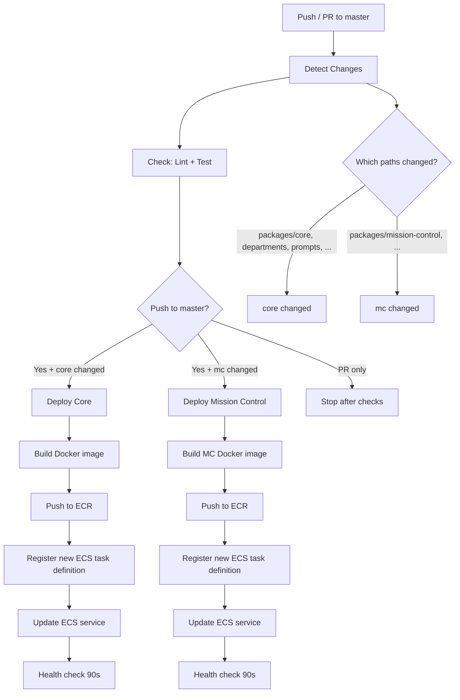

# .github/ -- CI/CD Workflows

Three GitHub Actions workflows automate checks, builds, and deployments for the yclaw monorepo.

## Workflows

### 1. Build & Deploy (`deploy.yml`)

The primary CI/CD pipeline. Runs on every push and PR to `master`, plus manual `workflow_dispatch`.

**Jobs:**

| Job | Runs On | Purpose |
|-----|---------|---------|
| `changes` | All triggers | Detects which paths changed using `dorny/paths-filter` |
| `check` | All triggers | `npm ci` + `npm audit` + `turbo lint` + `turbo test` |
| `deploy` | Push to master (core changed) | Builds `Dockerfile`, pushes to ECR, deploys to ECS |
| `deploy-mission-control` | Push to master (mc changed) | Builds `packages/mission-control/Dockerfile`, pushes to ECR, deploys to ECS |

**Change detection filters:**

| Filter | Paths |
|--------|-------|
| `core` | `packages/core/**`, `packages/memory/**`, `departments/**`, `prompts/**`, `skills/**`, `memory/**`, `repos/**`, `Dockerfile`, `entrypoint.sh`, `turbo.json`, `tsconfig.json`, `package.json`, `package-lock.json` |
| `mc` | `packages/mission-control/**`, `turbo.json`, `tsconfig.json`, `package.json`, `package-lock.json` |

**Auth:** OIDC federation via `aws-actions/configure-aws-credentials` (role ARN in `AWS_ROLE_ARN` secret). No static AWS keys in CI.

**Docker caching:** GitHub Actions cache (`type=gha`) scoped per service (`core`, `mc`).

**Health check:** Waits 90 seconds after deploying, then queries ECS for running vs desired task count. Never fails the build on slow rollouts -- ECS deployment circuit breaker handles rollback.

### 2. Agent Safety Guard (`agent-safety.yml`)

Runs on all PRs to `master`. Blocks changes to protected ("constitutional") paths unless the PR carries a `human-approved` label.

**Protected paths:**

| Path | Reason |
|------|--------|
| `.github/workflows/` | Agents must not modify their own CI/safety checks |
| `packages/core/src/safety/` | Outbound filtering, credential blocking |
| `packages/core/src/review/` | Architect review logic (circular trust risk) |

**Behavior:**
1. Diffs `origin/master...HEAD` to find changed files.
2. Matches changed files against protected path prefixes.
3. If any match, checks for the `human-approved` label via `gh pr view`.
4. Fails the check if the label is missing.

This is a CI-enforced constitutional guard. All other path protections (departments, prompts, CLAUDE.md) rely on Architect review and convention enforcement.

### 3. Build & Push LiteLLM Proxy (`litellm-build.yml`)

Builds and pushes the LiteLLM proxy Docker image. Triggered by pushes to `master` that modify `infra/litellm/**`, or manually via `workflow_dispatch`.

**Steps:** Checkout, OIDC auth, ECR login, `docker build` + `docker push` from `infra/litellm/`.

**Target:** `litellm-proxy:latest` in ECR.

## Infrastructure

| Resource | Value |
|----------|-------|
| AWS Region | `us-east-1` |
| ECS Cluster | `yclaw-cluster-production` |
| Core ECR Repo | `yclaw` |
| MC ECR Repo | `yclaw-mission-control` |
| LiteLLM ECR Repo | `litellm-proxy` |
| Core ECS Service | `yclaw-production` |
| MC ECS Service | `yclaw-mission-control-production` |

## Required Secrets

| Secret | Used By |
|--------|---------|
| `AWS_ROLE_ARN` | All deploy workflows (OIDC federation) |
| `GITHUB_TOKEN` | Agent Safety Guard (auto-provided) |

## Modifying Workflows

These files are protected by the Agent Safety Guard. Any PR that changes files under `.github/workflows/` requires the `human-approved` label to pass CI. This prevents agents from modifying their own safety checks.
