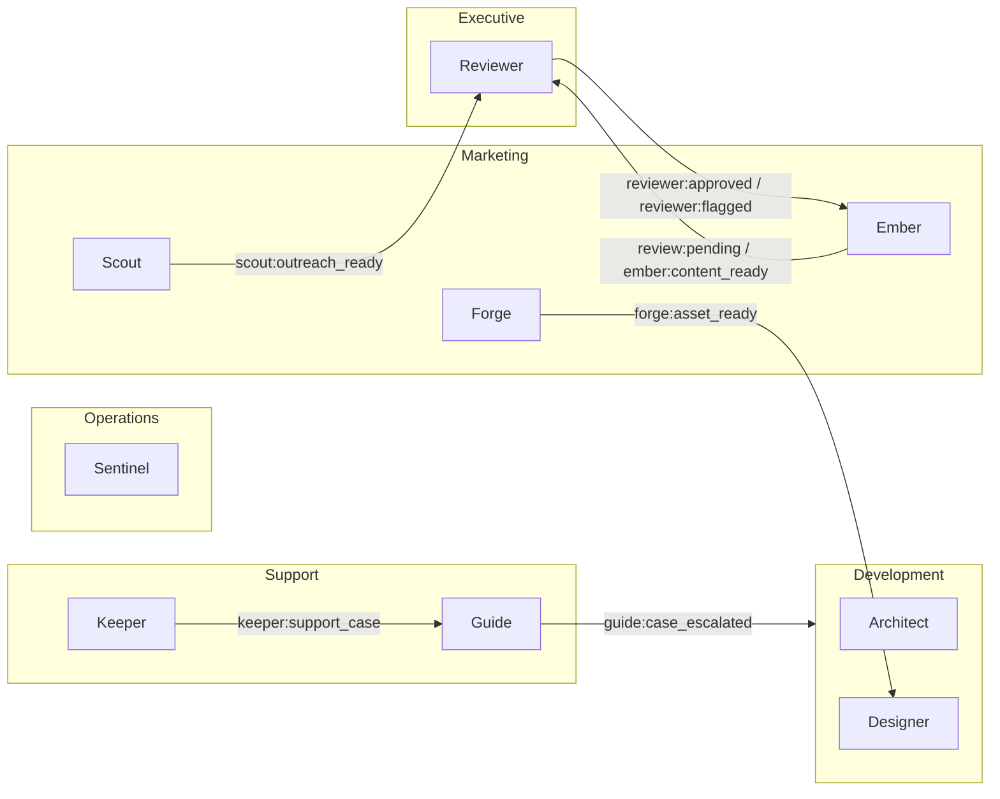

# Departments

The agent system consists of **12 agents** organized into **6 departments**. Each agent has a YAML config in its department folder, system prompts in `prompts/`, and runs on the shared runtime in `packages/core/`.

## Department Overview

| Department | Agents | Purpose |
|------------|--------|---------|
| [Executive](executive/) | Strategist, Reviewer | Strategic direction, standup synthesis, brand governance, and content approval |
| [Development](development/) | Architect, Designer | Code review, design enforcement, and development coordination |
| [Marketing](marketing/) | Ember, Forge, Scout | Content creation, visual asset production, and market intelligence |
| [Operations](operations/) | Sentinel, Librarian | System health, code quality audits, deployment verification, and knowledge curation |
| [Finance](finance/) | Treasurer | Treasury monitoring, spend tracking, and financial reporting |
| [Support](support/) | Guide, Keeper | Community moderation and tiered user support |

## Agent Roster

| Agent | Department | Model | Temperature |
|-------|------------|-------|-------------|
| Strategist | Executive | claude-opus-4-6 | 0.7 |
| Reviewer | Executive | claude-sonnet-4-6 | 0.0 |
| Architect | Development | claude-opus-4-6 | 0.3 |
| Designer | Development | claude-sonnet-4-6 | 0.1 |
| Ember | Marketing | claude-sonnet-4-6 | 0.7 |
| Forge | Marketing | claude-haiku-4-5 | 0.5 |
| Scout | Marketing | claude-sonnet-4-6 | 0.7 |
| Sentinel | Operations | claude-sonnet-4-6 | 0.0 |
| Librarian | Operations | claude-sonnet-4-6 | 0.0 |
| Treasurer | Finance | claude-sonnet-4-6 | 0.0 |
| Guide | Support | claude-sonnet-4-6 | 0.5 |
| Keeper | Support | claude-sonnet-4-6 | 0.5 |

## Organizational Architecture

```mermaid
flowchart TB
    subgraph EXEC["Executive"]
        STRATEGIST[Strategist]
        REVIEWER[Reviewer]
    end

    subgraph DEV["Development"]
        ARCHITECT[Architect]
        DESIGNER[Designer]
    end

    subgraph MKT["Marketing"]
        SCOUT[Scout]
        EMBER[Ember]
        FORGE[Forge]
    end

    subgraph OPS["Operations"]
        SENTINEL[Sentinel]
        LIBRARIAN[Librarian]
    end

    subgraph FIN["Finance"]
        TREASURER[Treasurer]
    end

    subgraph SUP["Support"]
        KEEPER[Keeper]
        GUIDE[Guide]
    end

    %% Strategist directives (top-down)
    STRATEGIST -. directive .-> ARCHITECT
    STRATEGIST -. directive .-> DESIGNER
    STRATEGIST -. directive .-> EMBER
    STRATEGIST -. directive .-> FORGE
    STRATEGIST -. directive .-> SCOUT
    STRATEGIST -. directive .-> SENTINEL
    STRATEGIST -. directive .-> LIBRARIAN
    STRATEGIST -. directive .-> TREASURER
    STRATEGIST -. directive .-> KEEPER
    STRATEGIST -. directive .-> GUIDE
    STRATEGIST -. directive .-> REVIEWER

    %% Standup reports (bottom-up)
    ARCHITECT -- standup:report --> STRATEGIST
    DESIGNER -- standup:report --> STRATEGIST
    EMBER -- standup:report --> STRATEGIST
    FORGE -- standup:report --> STRATEGIST
    SCOUT -- standup:report --> STRATEGIST
    SENTINEL -- standup:report --> STRATEGIST
    LIBRARIAN -- standup:report --> STRATEGIST
    TREASURER -- standup:report --> STRATEGIST
    GUIDE -- standup:report --> STRATEGIST
    REVIEWER -- standup:report --> STRATEGIST
```



## Cross-Department Event Flows

The agents communicate through an internal event bus. The following diagram shows the primary cross-department event flows (intra-department flows are documented in each department README).



## Shared Patterns

Every agent in the system shares these common behaviors:

### Daily Standup

All agents run a daily standup task on a staggered schedule between 13:00 and 13:45 UTC. Each publishes a `standup:report` event that the Strategist collects and synthesizes. Adjust the schedule in each agent's YAML config to match your operational hours.

| Time (UTC) | Agent |
|------------|-------|
| 13:00 | Reviewer |
| 13:02 | Architect |
| 13:08 | Designer |
| 13:10 | Ember |
| 13:12 | Scout |
| 13:14 | Forge |
| 13:15 | Sentinel |
| 13:18 | Librarian |
| 13:22 | Treasurer |
| 13:24 | Guide |
| 13:45 | Strategist (synthesis) |

### Claudeception Self-Reflection

Every agent subscribes to `claudeception:reflect` events and has a `self_reflection` task. This task uses a lighter model (`claude-sonnet-4-6` at temperature 0.5, 4096 tokens) to enable agents to learn from their experiences and capture reusable knowledge.

### System Prompts

All agents load a common base of system prompts:

| Prompt | Purpose | Used By |
|--------|---------|---------|
| `claudeception.md` | Self-learning framework | All agents |
| `skill-usage.md` | How to use learned skills | All agents |
| `mission_statement.md` | Organization mission | All agents |
| `chain-of-command.md` | Organizational hierarchy | All agents |

Department-specific prompts are layered on top (e.g., `engineering-standards.md` for Development, `brand-voice.md` for Marketing).

### Executive Directives

Every agent subscribes to its own directive event (`strategist:{agent}_directive` or `{agent}:directive`). This is the primary mechanism for top-down task assignment from the Executive department.

## Configuration Schema

Each agent YAML config follows this structure:

```yaml
name: agent-name
department: department-name
description: What this agent does

model:
  provider: anthropic
  model: model-id
  temperature: 0.0-1.0
  maxTokens: 4096-16384

system_prompts:
  - prompt1.md
  - prompt2.md

triggers:
  - type: cron | event | batch_event
    schedule: "cron expression"    # cron only
    event: source:type             # event only
    task: task_name
    model: {}                      # optional per-trigger model override

actions:
  - action:type

data_sources:                      # optional, used by Treasurer
  - name: source_name
    type: source_type
    config: {}

event_subscriptions:
  - event:type

event_publications:
  - event:type
```

## File Structure

```
departments/
├── README.md                  # This file
├── development/
│   ├── README.md
│   ├── architect.yaml
│   └── designer.yaml
├── executive/
│   ├── README.md
│   ├── strategist.yaml
│   └── reviewer.yaml
├── finance/
│   ├── README.md
│   └── treasurer.yaml
├── marketing/
│   ├── README.md
│   ├── ember.yaml
│   ├── forge.yaml
│   └── scout.yaml
├── operations/
│   ├── README.md
│   └── sentinel.yaml
└── support/
    ├── README.md
    ├── guide.yaml
    └── keeper.yaml
```
