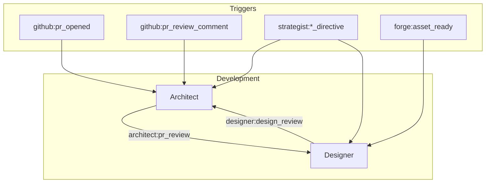

# Development Department

The Development department owns code review, design enforcement, and constrained mechanical repo operations. It contains three agents that collaborate through events to ensure code quality, design consistency, and reliable shell-level task execution.

## Agents

| Agent | Model | Role |
|-------|-------|------|
| **Architect** | claude-opus-4-6 | **Department Lead.** Reviews PRs for quality and security, plans project architecture, and coordinates with Operations on deployment readiness. |
| **Designer** | claude-sonnet-4-6 | Design system enforcer. Reviews frontend PRs for visual consistency, accessibility, and brand alignment. Shares the design system source of truth with Forge (Marketing). |
| **Mechanic** | claude-sonnet-4-6 | Constrained task runner for shell-required repo operations (lockfile sync, formatting, linting, branch rebasing). Does not write feature code or plan architecture. |

## Agent Interaction Flow

## Event Subscriptions and Publications

### Architect

| Direction | Event |
|-----------|-------|
| Subscribes | `github:pr_opened`, `github:pr_review_comment`, `strategist:architect_directive`, `claudeception:reflect` |
| Publishes | `standup:report`, `architect:pr_review`, `architect:task_complete` |

### Designer

| Direction | Event |
|-----------|-------|
| Subscribes | `forge:asset_ready`, `strategist:designer_directive`, `claudeception:reflect` |
| Publishes | `standup:report`, `designer:design_review` |

## Scheduled Tasks (Crons)

| Agent | Schedule (UTC) | Task |
|-------|----------------|------|
| Architect | 13:02 daily | `daily_standup` |
| Architect | 20:00 Sunday | `tech_debt_scan` |

## Key Capabilities

### Architect: Code Review and Architecture Planning

Architect reviews all incoming PRs for code quality, security, and architectural consistency. It also runs weekly tech debt scans to identify areas needing attention.

### Designer: Cross-Department Design Sync

Designer shares the design system with Forge (Marketing) and subscribes to `forge:asset_ready` to integrate design updates into the frontend. This keeps creative output and frontend implementation in sync through executive coordination.

### Mechanic: Constrained Shell Execution

Mechanic executes whitelisted shell-required repo operations (lockfile sync, formatting, linting, branch rebasing). It is triggered by Architect directives (`architect:mechanic_task`) and CI events (`ci:lockfile_drift`). Mechanic does not plan, review, or write feature code — it is a narrow executor for tasks that require shell access that the other agents cannot perform safely via the GitHub API alone.

## Actions Available

Table reflects each agent's actual YAML `actions:` block as of this commit.

| Action | Architect | Designer | Mechanic |
|--------|:---------:|:--------:|:--------:|
| `github:get_contents` | x | x | x |
| `github:get_diff` | x | x | x |
| `github:pr_comment` | x | x | x |
| `github:create_branch` | | x | x |
| `github:commit_file` | | x | x |
| `github:commit_batch` | | | x |
| `github:get_issue` | x | | |
| `github:create_issue` | x | x | |
| `github:list_issues` | x | | |
| `github:update_issue` | x | | |
| `github:add_labels` | x | | |
| `github:remove_label` | x | | |
| `github:pr_review` | | x | |
| `ao:status` | x | | |
| `repo:list` | x | | |
| `vault:read` | x | | |
| `vault:search` | x | | |
| `vault:write` | x | | |
| `deploy:assess` | x | | |
| `discord:message` | x | x | x |
| `discord:thread_reply` | x | x | x |
| `discord:react` | x | x | |
| `event:publish` | x | x | x |
| `figma:*` (9 actions) | | x | |
| `stitch:*` (7 actions) | | x | |

## Customization

Customize `prompts/architect-workflow.md` and `prompts/designer-workflow.md` for your development process. The Architect's review criteria and Designer's design system rules are configured through these prompt files.

## Configuration Files

- [`architect.yaml`](architect.yaml) -- Architect agent config
- [`designer.yaml`](designer.yaml) -- Designer agent config
- [`mechanic.yaml`](mechanic.yaml) -- Mechanic agent config
