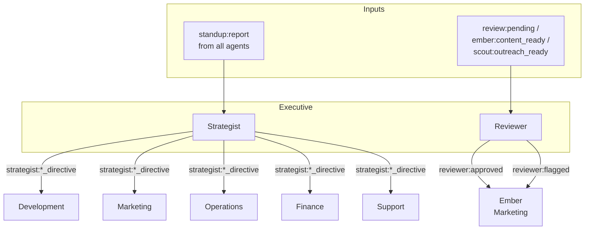

# Executive Department

The Executive department provides strategic direction and brand governance for the entire agent organization. It contains two agents: Strategist (the organizational brain) and Reviewer (the brand gatekeeper). Configure your organization's strategic priorities in `prompts/mission_statement.md` and brand standards in `prompts/brand-voice.md`.

## Agents

| Agent | Model | Role |
|-------|-------|------|
| **Strategist** | claude-opus-4-6 | Sets weekly priorities, allocates resources across departments, and synthesizes standup reports from all teams into actionable directives. Acts as the organizational "whip." |
| **Reviewer** | claude-sonnet-4-6 | Brand guardian. Reviews all external-facing content against brand voice, terminology standards, and legal guidelines. Zero-tolerance gatekeeper with deterministic evaluation (temperature 0). |

## Agent Interaction Flow

## Event Subscriptions and Publications

### Strategist

| Direction | Event |
|-----------|-------|
| Subscribes | `standup:report` (batch, min 8, 20-min timeout), `claudeception:reflect`, `sentinel:alert`, `ao:task_failed`, `ao:spawn_failed`, `architect:task_blocked` |
| Publishes | `strategist:weekly_directive`, `strategist:midweek_adjustment`, `strategist:standup_synthesis`, and per-agent directives (`strategist:{agent}_directive` for each agent in the organization) |

### Reviewer

| Direction | Event |
|-----------|-------|
| Subscribes | `review:pending`, `ember:content_ready`, `scout:outreach_ready`, `reviewer:directive`, `claudeception:reflect` |
| Publishes | `standup:report`, `reviewer:approved`, `reviewer:flagged` |

## Scheduled Tasks (Crons)

| Agent | Schedule (UTC) | Task |
|-------|----------------|------|
| Strategist | 14:00 Monday | `weekly_directive` |
| Strategist | 14:00 Wednesday | `midweek_review` |
| Strategist | 07:00 1st of month | `monthly_strategy` |
| Strategist | 14:00 1st Monday of month | `model_review` |
| Strategist | Every 30 min (13:00-03:00 UTC) | `heartbeat` |

## Key Capabilities

### Strategist: Standup Synthesis

The Strategist uses a `batch_event` trigger to collect `standup:report` events from all agents. It waits for a minimum of 10 reports (or a 30-minute timeout), then synthesizes them into a unified status picture and actionable directives.

### Strategist: Heartbeat

The heartbeat task runs every 4 hours. It uses a lighter model (`claude-sonnet-4-6`) and a reduced prompt set to monitor system health at low cost.

### Strategist: Cross-Department Directives

The Strategist publishes agent-specific directives to every agent in the organization. Each directive follows the `strategist:{agent}_directive` naming pattern and targets one agent directly. This is the primary mechanism for top-down task assignment.

### Reviewer: Content Gate

The Reviewer operates at temperature 0 for deterministic evaluation. All external-facing content must pass through the Reviewer before publication:

1. Content arrives via `review:pending`, `ember:content_ready`, or `scout:outreach_ready`.
2. Reviewer evaluates against brand voice, terminology, and legal guidelines.
3. Approved content triggers `reviewer:approved` (Ember publishes it).
4. Flagged content triggers `reviewer:flagged` (Ember revises it).

## Actions Available

| Action | Strategist | Reviewer |
|--------|:----------:|:--------:|
| `github:commit_file` | x | |
| `github:get_contents` | x | x |
| `github:create_branch` | x | |
| `github:get_diff` | x | x |
| `github:pr_review` | x | x |
| `github:pr_comment` | x | x |
| `github:get_issue` | x | x |
| `github:list_issues` | x | |
| `github:create_issue` | | x |
| `vault:read` | x | x |
| `vault:search` | x | x |
| `x:search` | x | x |
| `x:user` | x | |
| `telegram:announce` | x | |
| `telegram:set_title` | x | |
| `telegram:set_description` | x | |
| `discord:message` | x | x |
| `discord:thread_reply` | x | x |
| `discord:react` | x | x |
| `discord:alert` | | x |
| `event:publish` | x | x |
| `deploy:assess` | x | |
| `deploy:execute` | | |
| `task:query` | x | x |
| `task:summary` | x | |

Notes:
- `twitter:update_profile*` moved from Strategist to Ember (marketing owns the brand surface).
- `deploy:execute` moved from Strategist to Sentinel (separation of duties). Strategist retains `deploy:assess` for coordination.
- Reviewer gained PR/issue read + `github:create_issue` + `vault:read/search` + `task:query` (review queue monitoring).

## Configuration Files

- [`strategist.yaml`](strategist.yaml) -- Strategist agent config
- [`reviewer.yaml`](reviewer.yaml) -- Reviewer agent config
