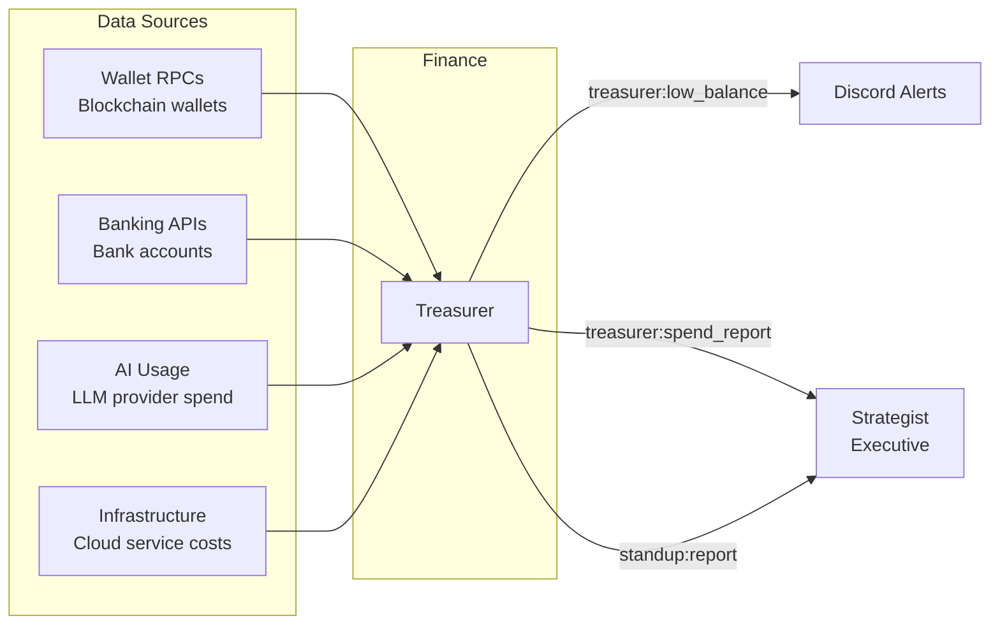

# Finance Department

The Finance department tracks treasury balances, infrastructure costs, and AI service spending across the organization. It contains a single agent -- Treasurer -- that monitors financial data sources including wallets, bank accounts, and cloud service costs.

## Agents

| Agent | Model | Role |
|-------|-------|------|
| **Treasurer** | claude-sonnet-4-6 | Financial watchdog. Runs daily treasury checks, weekly spend tracking, and monthly financial summaries. Alerts on low balances and anomalous spending patterns. Operates at temperature 0 for deterministic financial reporting. |

## Data Flow



## Event Subscriptions and Publications

### Treasurer

| Direction | Event |
|-----------|-------|
| Subscribes | `treasurer:directive`, `claudeception:reflect` |
| Publishes | `standup:report`, `treasurer:low_balance`, `treasurer:spend_report` |

## Scheduled Tasks (Crons)

| Schedule (UTC) | Task | Description |
|----------------|------|-------------|
| 13:22 daily | `daily_standup` | Daily standup report |
| 07:00 daily | `treasury_check` | Check all wallet balances and flag anomalies |
| 08:00 Monday | `weekly_spend` | Weekly spending breakdown |
| 08:00 1st of month | `monthly_summary` | Monthly financial summary |

## Data Sources

Treasurer supports multiple data source types. Configure your specific wallets, accounts, and services in `departments/finance/treasurer.yaml` under the `data_sources` section.

### Supported Source Types

**Core (default):**

| Source Type | Description | Example Providers |
|-------------|-------------|-------------------|
| `ai_usage` | LLM provider spend tracking | LiteLLM, OpenRouter, direct provider APIs |
| `infra_cost` | Cloud infrastructure cost monitoring | AWS Cost Explorer, GCP Billing, Azure Cost Management |

**Optional (configure if relevant to your org):**

| Source Type | Description | Example Providers |
|-------------|-------------|-------------------|
| `blockchain_rpc` | On-chain wallet balance monitoring | Helius, Alchemy, Infura, QuickNode |
| `banking_api` | Bank account balance and transaction data | Teller.io, Plaid, Mercury |

Each data source is defined with a `name`, `type`, and `config` block in the agent YAML. See the [Configuration Schema](../README.md#configuration-schema) for the full format.

## Key Capabilities

### Multi-Source Treasury Monitoring

Treasurer monitors wallet balances across configured blockchain RPCs. Add wallet data sources in `treasurer.yaml` to track native balances and token accounts on any supported chain.

### Banking Integration

Banking integrations provide read-only access to connected accounts. SSRF protection rejects full URLs in endpoint config to prevent credential leakage. Configure your banking provider in the `data_sources` section.

### Infrastructure Cost Tracking

Infrastructure cost fetchers track spending across cloud providers. Configure your active cloud services in `treasurer.yaml` to enable cost monitoring and alerting.

### Alert Thresholds

Treasurer publishes `treasurer:low_balance` alerts when balances drop below configured thresholds. Adjust thresholds in `treasurer.yaml` to match your actual balances.

## Skills

The Treasurer has 3 specialized skills:

1. `treasury-operations` -- Operational procedures (on-demand)
2. `ai-usage-tracking` -- AI spend monitoring guide
3. `infra-cost-tracking` -- Infrastructure cost monitoring guide

## Actions Available

| Action | Treasurer |
|--------|:---------:|
| `github:get_contents` | x |
| `discord:message` | x |
| `discord:thread_reply` | x |
| `discord:react` | x |
| `discord:alert` | x |
| `event:publish` | x |

## Customization

Configure your wallets and financial data sources in `departments/finance/treasurer.yaml`. Each data source needs a `name`, `type`, and provider-specific `config` block. Alert thresholds for low balance warnings can also be configured per data source.

## Escalation Suppression

Treasurer supports suppressing alerts for specific data sources during known events (e.g., maintenance windows, intentional unfunding). Configure in `treasurer.yaml`:

```yaml
escalation_suppression:
  maintenance_window:
    wallets:
      - <source_name>
    reason: "Intentionally paused during infrastructure migration"
    rules:
      suppress_low_balance_alerts: true
      suppress_executive_escalation: true
      include_in_weekly_spend_report: true
      note_in_reports_as: "Paused (maintenance)"
    effective_date: YYYY-MM-DD
    review_trigger: "Re-enable when migration completes"
```

This prevents alert fatigue during planned events while still including the data in regular reports.

## Data Source Activation Checklist

The Treasurer YAML defines five cost data sources. Only `openrouter_usage` is
live by default. Activation steps for the others:

### AWS Cost Explorer (`aws_cost_monthly`)

The IAM identity used by the Treasurer agent needs `ce:GetCostAndUsage` and
`ce:GetCostForecast`. Attach this policy (or inline) to the Treasurer's role:

```json
{
  "Version": "2012-10-17",
  "Statement": [
    {
      "Sid": "TreasurerCostExplorerRead",
      "Effect": "Allow",
      "Action": [
        "ce:GetCostAndUsage",
        "ce:GetCostForecast",
        "ce:GetDimensionValues"
      ],
      "Resource": "*"
    }
  ]
}
```

No new secrets required — uses the existing AWS credentials already available
to the agent runtime.

### MongoDB Atlas (`mongodb_atlas_billing`)

1. In Atlas → Organization → **Access Manager** → **Applications**, create
   an API key with the **Org Billing Viewer** role.
2. Add these to the agent runtime's secret store:
   - `MONGODB_ATLAS_PUBLIC_KEY`
   - `MONGODB_ATLAS_PRIVATE_KEY`
   - `MONGODB_ATLAS_ORG_ID`

### Redis Cloud (`redis_cloud_billing`)

1. In the Redis Cloud console → **Access Management** → **API Keys**,
   generate an account-level API key + secret key.
2. Add to the agent runtime's secret store:
   - `REDIS_CLOUD_API_KEY`
   - `REDIS_CLOUD_SECRET_KEY`

### LiteLLM (`litellm_spend`)

Only activate if you deploy a LiteLLM proxy in front of your providers.
Treasurer skips this source gracefully when the fetcher is not registered.

### Verification

After activating any source, Treasurer's next daily `treasury_check` run
should report `[X]/[Y] sources active` with the newly activated source in
the active count. If activation fails silently, check the agent runtime
logs for fetcher registration warnings.

## Configuration Files

- [`treasurer.yaml`](treasurer.yaml) -- Treasurer agent config
