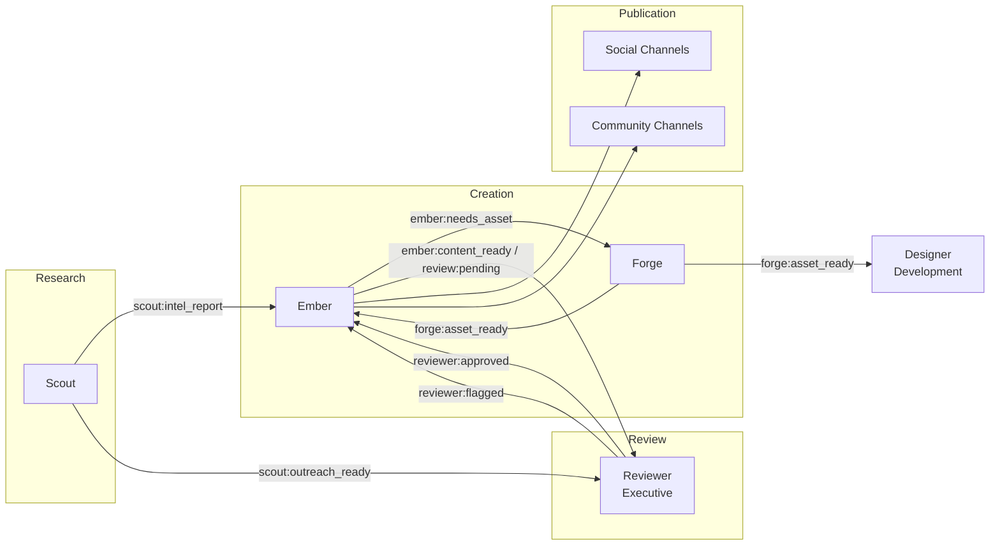

# Marketing Department

The Marketing department handles external communications, content creation, and community growth. It contains three agents that form a research-to-publication pipeline: Scout gathers intelligence, Ember produces content, and Forge creates visual assets.

> **Note:** The default YAML configs use `telegram:*` actions for community channels. If your community uses a different platform, replace these with your platform's action identifiers (e.g., `discord:*`, `slack:*`).

## Agents

| Agent | Model | Role |
|-------|-------|------|
| **Scout** | claude-sonnet-4-6 | Research and intelligence agent. Monitors trends, competitive landscape, news, and community sentiment. Identifies partnership prospects and manages outreach. |
| **Ember** | claude-sonnet-4-6 | Content engine. Creates and publishes posts across configured social channels. Generates daily content batches and coordinates with Forge for visual assets. |
| **Forge** | claude-haiku-4-5 | Creative studio. Produces visual and video assets on demand using Flux image generation and video tools. Maintains brand consistency through the shared design system. |

## Content Pipeline

## Event Subscriptions and Publications

### Scout

| Direction | Event |
|-----------|-------|
| Subscribes | `scout:directive`, `claudeception:reflect` |
| Publishes | `standup:report`, `scout:intel_report`, `scout:outreach_ready`, `scout:pipeline_report`, `review:pending` |

### Ember

| Direction | Event |
|-----------|-------|
| Subscribes | `forge:asset_ready`, `ember:directive`, `reviewer:approved`, `reviewer:flagged`, `claudeception:reflect` |
| Publishes | `standup:report`, `ember:needs_asset`, `ember:content_ready`, `review:pending` |

### Forge

| Direction | Event |
|-----------|-------|
| Subscribes | `ember:needs_asset`, `ember:asset_revision_requested`, `strategist:forge_directive`, `claudeception:reflect` |
| Publishes | `standup:report`, `forge:asset_ready`, `forge:asset_failed` |

## Scheduled Tasks (Crons)

| Agent | Schedule (UTC) | Task | Notes |
|-------|----------------|------|-------|
| Scout | 13:12 daily | `daily_standup` | |
| Scout | 08:00 Mon-Fri | `daily_intel_scan` | |
| Scout | 10:00 Monday | `weekly_prospecting` | |
| Scout | 10:00 Wednesday | `follow_ups` | |
| Scout | 16:00 Friday | `pipeline_report` | |
| Scout | 09:00 1st of month | `x_algorithm_research` | |
| Ember | 13:10 daily | `daily_standup` | |
| Ember | 14:00 Mon-Fri | `daily_content_batch` | 10:00 AM ET |
| Ember | 16:30 Mon-Fri | `midday_post` | 12:30 PM ET |
| Ember | 22:00 Mon-Fri | `afternoon_engagement` | 6:00 PM ET |
| Ember | 15:00 Sat-Sun | `weekend_content` | 11:00 AM ET |
| Forge | 10:00 Monday | `weekly_asset_generation` | Weekly asset pack |
| Forge | 09:00 1st of month | `monthly_brand_review` | Profile/banner review |

## Key Capabilities

### Ember: Content Scheduling and Humanization

Ember posts content on a configurable weekday/weekend schedule. It uses **content weights** to balance output:

| Content Type | Weight |
|--------------|--------|
| `explainer_thread` | 2 |
| `engagement_post` | 2 |
| `market_observation` | 1 |
| `news_commentary` | 1 |

Ember has `humanize: true` enabled, which adjusts output to sound more natural and less robotic.

### Ember: Review Gate

All content passes through the Reviewer (Executive) before publication. Ember publishes `review:pending` or `ember:content_ready`, waits for `reviewer:approved` or `reviewer:flagged`, then either publishes or revises.

### Scout: Partnership Prospecting

Scout runs weekly prospecting (Monday) and follow-ups (Wednesday) to identify and manage partnership opportunities. Outreach content goes through the Reviewer before sending.

Scout has `humanize: false` -- its output is internal intelligence, not public-facing.

### Forge: Visual Asset Production

Forge uses AI generation tools to produce images and video:

- `flux:generate` -- Image generation
- `video:text_to_video`, `video:image_to_video`, `video:edit`, `video:veo_generate` -- Video production
- `twitter:media_upload` -- Direct media upload to social platforms
- `telegram:set_photo` -- Community channel branding

Forge runs on `claude-haiku-4-5` (the lightest model) since its primary work is orchestrating external generation tools rather than complex reasoning.

### Cross-Department: Design System Sync

Forge and Designer (Development) share the design system source of truth. When Forge produces a new asset (`forge:asset_ready`), Designer receives the event to verify frontend alignment.

## Actions Available

| Action | Scout | Ember | Forge |
|--------|:-----:|:-----:|:-----:|
| `github:commit_file` | x | x | x |
| `github:get_contents` | x | x | x |
| `github:create_branch` | x | x | x |
| `x:search` | x | x | |
| `x:lookup` | x | x | |
| `x:user` | x | x | |
| `x:user_tweets` | x | x | |
| `twitter:read_metrics` | x | | |
| `twitter:post` | | x | |
| `twitter:thread` | | x | |
| `twitter:reply` | | x | |
| `twitter:like` | | x | |
| `twitter:retweet` | | x | |
| `twitter:media_upload` | | x | x |
| `twitter:update_profile` | | x | |
| `twitter:update_profile_image` | | x | x |
| `twitter:update_profile_banner` | | x | x |
| `telegram:message` | | x | |
| `telegram:announce` | | x | |
| `telegram:set_photo` | | | x |
| `flux:generate` | | | x |
| `video:*` | | | x |
| `email:send` | x | | |
| `slack:message` | x | x | x |
| `slack:thread_reply` | x | x | x |
| `event:publish` | x | x | x |

## Customization

Configure your channels, posting schedule, and content strategy in `prompts/content-templates.md`. The content weights, posting times, and platform-specific rules can all be adjusted to match your audience and time zones.

## Configuration Files

- [`scout.yaml`](scout.yaml) -- Scout agent config
- [`ember.yaml`](ember.yaml) -- Ember agent config
- [`forge.yaml`](forge.yaml) -- Forge agent config
