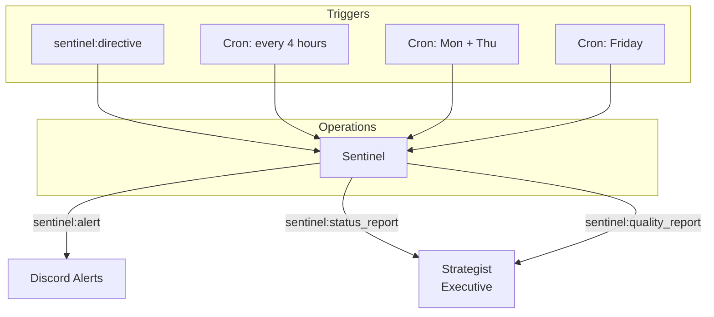

# Operations Department

The Operations department owns system health, code quality auditing, and deployment pipeline verification. It contains two agents focused entirely on internal infrastructure and knowledge management.

## Agents

| Agent | Model | Role |
|-------|-------|------|
| **Sentinel** | claude-sonnet-4-6 | System health and DevOps agent. Runs code quality audits, monitors deployment pipelines, and performs post-deploy verification. |
| **Librarian** | claude-sonnet-4-6 | Knowledge curator. Maintains the organizational vault — reviews incoming notes from `vault/05-inbox/`, deduplicates, moves to permanent locations, and ensures taxonomy quality. |

## Agent Interaction Flow

## Event Subscriptions and Publications

### Sentinel

| Direction | Event |
|-----------|-------|
| Subscribes | `strategist:sentinel_directive`, `claudeception:reflect`, `architect:deploy_complete`, `deploy:approved` |
| Publishes | `standup:report`, `sentinel:alert`, `sentinel:status_report`, `sentinel:quality_report` |

## Scheduled Tasks (Crons)

| Schedule (UTC) | Task | Description |
|----------------|------|-------------|
| 13:15 daily | `daily_standup` | Daily standup report |
| Every 4 hours | `deployment_health` | Check deployment pipeline health |
| 10:00 Mon, Thu | `code_quality_audit` | Run code quality audits across repos |
| 17:00 Friday | `weekly_repo_digest` | Summarize repository activity for the week |

## Key Capabilities

### Post-Deploy Verification

After Architect publishes `architect:deploy_complete` (the AO orchestrator shipped a new ECS revision), Sentinel runs post-deployment checks to verify the release is healthy. If problems are detected, Sentinel publishes `sentinel:alert` and notifies the team via Discord. The Deployer agent was retired in the AO migration (2026-03-27).

### Code Quality Audits

Sentinel runs code quality audits twice a week (Monday and Thursday). It uses `github:get_contents` and `github:get_diff` to inspect repositories directly and produce quality reports. Sentinel does NOT run `codegen:execute` — it is a read-only auditor that publishes findings as events; remediation is routed to Architect/Mechanic via Strategist.

### Deployment Health Monitoring

Every 4 hours, Sentinel checks the health of deployment pipelines using `deploy:assess` and `deploy:status`. This proactive monitoring catches infrastructure issues before they block deployments.

### Weekly Repository Digest

Every Friday at 17:00 UTC, Sentinel produces a summary of repository activity across the organization, surfacing trends and areas that need attention.

## Actions Available

| Action | Sentinel | Librarian |
|--------|:--------:|:---------:|
| `deploy:assess` | x | |
| `deploy:status` | x | |
| `deploy:execute` | x | |
| `github:get_contents` | x | x |
| `github:get_diff` | x | |
| `github:commit_file` | | x |
| `repo:list` | x | |
| `vault:read` / `vault:search` / `vault:write` / `vault:graph_query` | | x |
| `discord:message` | x | x |
| `discord:thread_reply` | x | x |
| `discord:get_channel_history` | x | |
| `discord:get_thread` | x | |
| `discord:react` | x | x |
| `discord:alert` | x | |
| `event:publish` | x | x |

## Configuration Files

- [`sentinel.yaml`](sentinel.yaml) -- Sentinel agent config
- [`librarian.yaml`](librarian.yaml) -- Librarian agent config

