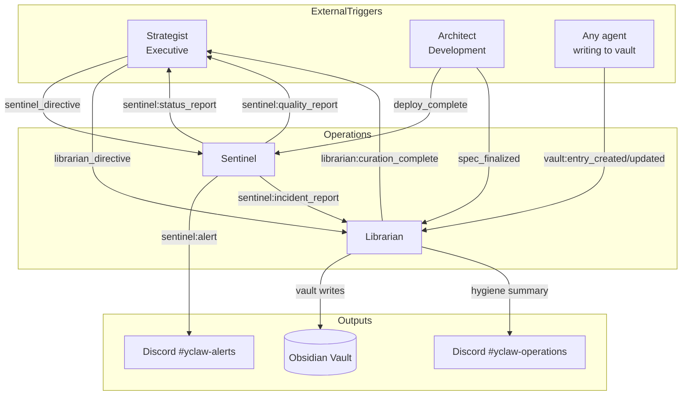

# Operations Department

The Operations department owns system health, code quality auditing, deployment pipeline verification, and knowledge curation. It contains two agents focused entirely on internal infrastructure and organizational memory.

## Mission

Keep the YCLAW agent org healthy (Sentinel) and coherent over time (Librarian). Sentinel watches the present — infrastructure, deploys, code quality, incidents. Librarian preserves the past — architecture decisions, incident post-mortems, operational knowledge — so future agents do not rederive what's already been learned.

## Agents

| Agent | Model | Role |
|-------|-------|------|
| **Sentinel** | claude-sonnet-4-6 | System health and DevOps. Runs code quality audits, monitors deployment pipelines, performs post-deploy verification, probes AO health, handles incident triage and alert noise control. |
| **Librarian** | claude-sonnet-4-6 | Knowledge curator. Maintains the Obsidian vault — triages `vault/05-inbox/`, ingests contributions from other agents, curates incident post-mortems and architecture decisions, enforces taxonomy and schema, runs hygiene audits. |

## Agent Interaction Flow

### Interaction Pattern

1. **Sentinel detects** — code quality issues, deploy problems, AO health anomalies, incidents.
2. **Sentinel reports** — publishes `sentinel:alert`, `sentinel:status_report`, `sentinel:quality_report`, `sentinel:incident_report`.
3. **Librarian curates** — subscribes to `sentinel:incident_report` and `architect:spec_finalized`, persists them into the permanent vault at `vault/10-incidents/` and `vault/20-architecture/`.
4. **Strategist synthesizes** — reads Sentinel status and Librarian curation summaries during daily standup synthesis.

Librarian does NOT write Sentinel's alerts to the vault directly. Only resolved incident post-mortems (via `sentinel:incident_report`) reach permanent storage. Noise stays in Discord.

## Event Subscriptions and Publications

### Sentinel

| Direction | Event |
|-----------|-------|
| Subscribes | `strategist:sentinel_directive`, `claudeception:reflect`, `architect:deploy_complete`, `deploy:approved` |
| Publishes | `standup:report`, `sentinel:alert`, `sentinel:status_report`, `sentinel:quality_report`, `sentinel:incident_report` |

### Librarian

| Direction | Event |
|-----------|-------|
| Subscribes | `claudeception:reflect`, `strategist:librarian_directive`, `vault:entry_created`, `vault:entry_updated`, `sentinel:incident_report`, `architect:spec_finalized` |
| Publishes | `standup:report`, `librarian:curation_complete` |

## Scheduled Tasks (Crons)

| Schedule (UTC) | Agent | Task | Description |
|----------------|-------|------|-------------|
| 13:15 daily | Sentinel | `daily_standup` | Daily standup report |
| 13:18 daily | Librarian | `daily_standup` | Daily standup report |
| 13:30 daily | Librarian | `inbox_triage` | Fast triage of `vault/05-inbox/` |
| 14:00 daily | Librarian | `daily_curation` | Deep pass: normalize, tag, link, publish |
| Every 4h | Sentinel | `deployment_health` | Check deployment pipeline health |
| Every 30m | Sentinel | `ao_health_check` | Probe AO `/health/deep` (early-exit on healthy) |
| 10:00 Mon,Thu | Sentinel | `code_quality_audit` | Read-only quality sweep across repos |
| 08:00 Monday | Librarian | `weekly_curation` | Full hygiene audit: orphans, stale, broken links, schema |
| 09:00 Friday | Librarian | `knowledge_hygiene_audit` | Narrow mid-week check: broken links + schema only |
| 17:00 Friday | Sentinel | `weekly_repo_digest` | Weekly repository activity summary |

## Key Capabilities

### Post-Deploy Verification (Sentinel)

Activates on `architect:deploy_complete` (the AO orchestrator ships a new ECS revision — Deployer was retired in the AO migration). Waits 2 minutes for stabilization, checks `/health`, smoke-tests a lightweight agent, scans for startup errors. Posts pass/fail to the operations channel; publishes `sentinel:alert` on failure.

### Code Quality Audits (Sentinel)

Runs Monday and Thursday. Reads repos via `github:get_contents` and `github:get_diff` (Sentinel is a read-only auditor; it does NOT run `codegen:execute`). Severity classification per `skills/sentinel/code-audit-standards.md`. Remediation is routed to Architect/Mechanic via `sentinel:alert` events — Sentinel reports, it does not open PRs.

### Deployment Health Monitoring (Sentinel)

Every 4 hours, uses `deploy:assess` and `deploy:status` against tracked services. Cross-checks against `sha-drift` baselines. Posts status to the operations channel; alerts only on degradation.

### AO Health Probe (Sentinel)

Every 30 minutes, probes AO `/health/deep`. Early-exits on healthy response to keep cost low. Fires `sentinel:alert` after 3 consecutive failures (~90 min sustained). Planned migration to a non-LLM probe is in the Sentinel YAML TODO.

### Incident Triage (Sentinel)

Skill: `skills/sentinel/incident-triage/SKILL.md`. Classifies incidents (Infrastructure / Application / Integration / Security), checks deploy correlation window, measures blast radius, escalates per `escalation-policy.md`.

### Alert Noise Control (Sentinel)

Skill: `skills/sentinel/alerting-noise-control/SKILL.md`. Dedup (30-min same-resource window), batching (LOW severity only), escalation ladder (30-min auto-promote if unresolved), suppression windows during deploys, 1-hour cool-down after recovery. Security/outage/data-loss alerts bypass all suppression.

### Knowledge Curation (Librarian)

Skill: `skills/librarian/knowledge-curation-workflow/SKILL.md`. Intake → Deduplicate → Normalize → Tag → Link → Write → Report. Full provenance block on every entry (source_agent, source_event, timestamps, confidence, status). See `prompts/librarian-curation-workflow.md` for the per-task playbooks.

### Vault Hygiene (Librarian)

Skill: `skills/librarian/vault-hygiene-audit/SKILL.md`. Six checks on a weekly cadence: orphans, stale entries, broken links, schema violations, size anomalies, tag vocabulary compliance. Mid-week narrow pass (broken links + schema) on Fridays.

### Taxonomy Enforcement (Librarian)

Skill: `skills/librarian/taxonomy-and-tagging/SKILL.md`. Seven top-level categories (`architecture`, `operations`, `incidents`, `decisions`, `standards`, `agents`, `deployments`). Required tag namespaces (`category:*`, `source:*`, `status:*`). Controlled vocabulary — free-form tags are rejected at write time.

## Actions Available

| Action | Sentinel | Librarian |
|--------|:--------:|:---------:|
| `deploy:assess` / `deploy:status` / `deploy:execute` | x | |
| `github:get_contents` | x | x |
| `github:get_diff` | x | |
| `github:commit_file` | | x |
| `repo:list` | x | |
| `vault:read` / `vault:search` / `vault:write` / `vault:graph_query` | | x |
| `discord:message` / `discord:thread_reply` / `discord:react` | x | x |
| `discord:get_channel_history` / `discord:get_thread` / `discord:alert` | x | |
| `event:publish` | x | x |

## Shared Resources

Both agents load: `claudeception.md`, `skill-usage.md`, `mission_statement.md`, `chain-of-command.md`, `daily-standup.md`, `protocol-overview.md`, `data-integrity.md`, `escalation-policy.md`.

Sentinel-specific: `executive-directive.md`, `engineering-standards.md`, `sentinel-quality-workflow.md`.

Librarian-specific: `librarian-curation-workflow.md` (covers all of Librarian's task prompts: standup, inbox_triage, daily_curation, weekly_curation, knowledge_hygiene_audit, handle_directive, ingest_vault_contribution, review_vault_update, curate_incident_report, curate_architecture_decision, self_reflection).

## Skills

| Agent | Skill | Purpose |
|-------|-------|---------|
| Sentinel | `code-audit-standards.md` | Severity rubric for code-quality findings |
| Sentinel | `deploy-health-checklist.md` | Four-hourly deployment health checks |
| Sentinel | `post-deploy-verification.md` | `architect:deploy_complete` verification flow |
| Sentinel | `incident-triage/SKILL.md` | Incident classification + triage steps |
| Sentinel | `alerting-noise-control/SKILL.md` | Dedup, batching, suppression |
| Sentinel | `repo-hygiene-audit/SKILL.md` | Beyond-code repo health signals |
| Librarian | `knowledge-curation-workflow/SKILL.md` | Master curation pipeline |
| Librarian | `taxonomy-and-tagging/SKILL.md` | Controlled vocabulary + naming |
| Librarian | `deduplication-and-merge/SKILL.md` | Handling duplicates and overlaps |
| Librarian | `data-integrity-and-provenance/SKILL.md` | Versioning + audit trail |
| Librarian | `vault-hygiene-audit/SKILL.md` | Periodic vault health checks |
| Librarian | `graph-linking-rules/SKILL.md` | `see_also` edge types and validation |

## Configuration Files

- [`sentinel.yaml`](sentinel.yaml) — Sentinel agent config
- [`librarian.yaml`](librarian.yaml) — Librarian agent config
