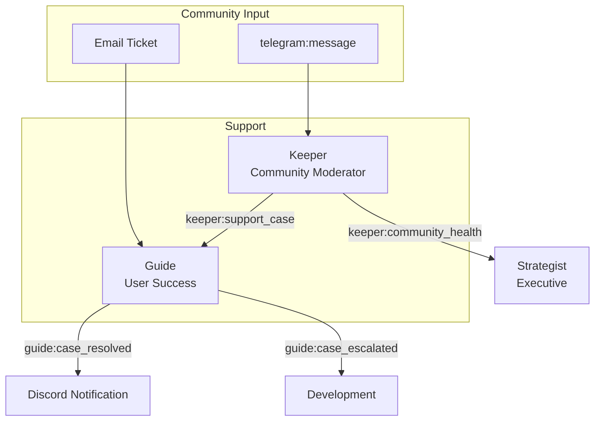

# Support Department

The Support department handles community moderation and user support. It contains two agents that form a tiered support pipeline: Keeper handles first-contact moderation, and Guide resolves escalated cases via deeper troubleshooting and email.

> **Note:** The YAML configs include both `telegram:*` and `discord:*` actions. Configure your community channels in the agent YAML files.

## Agents

| Agent | Model | Role |
|-------|-------|------|
| **Keeper** | claude-sonnet-4-6 | Reactive community moderator. First point of contact for community members in configured channels. Handles moderation (ban, restrict, delete), FAQ responses, and escalates complex cases to Guide. |
| **Guide** | claude-sonnet-4-6 | User success agent. Handles escalated support cases from Keeper and direct email tickets. Provides deep troubleshooting and resolves issues via email. |

## Support Escalation Flow

## Event Subscriptions and Publications

### Keeper

| Direction | Event |
|-----------|-------|
| Subscribes | `telegram:message`, `discord:message`, `discord:mention`, `strategist:keeper_directive`, `claudeception:reflect` |
| Publishes | `standup:report`, `keeper:support_case`, `keeper:community_health` |

### Guide

| Direction | Event |
|-----------|-------|
| Subscribes | `keeper:support_case`, `strategist:guide_directive`, `claudeception:reflect` |
| Publishes | `standup:report`, `guide:case_resolved`, `guide:case_escalated` |

## Scheduled Tasks (Crons)

| Agent | Schedule (UTC) | Task |
|-------|----------------|------|
| Keeper | 13:20 daily | `daily_standup` |
| Guide | 13:24 daily | `daily_standup` |

### Keeper: Disabled Crons

The following crons are commented out in Keeper's config. Enable them after configuring your community channels:

| Schedule (UTC) | Task | Description |
|----------------|------|-------------|
| 08:00 daily | `morning_stats` | Community statistics summary |
| 15:00 Friday | `community_highlights` | Weekly community highlights |

## Key Capabilities

### Keeper: Community Moderation

Keeper handles Telegram and Discord community events (`telegram:message`, `discord:message`, `discord:mention`) and runs a daily standup cron. It handles:

- **Moderation actions**: Ban, restrict, delete messages, set permissions
- **FAQ responses**: Answers common community questions
- **Escalation**: Complex cases published as `keeper:support_case` for Guide
- **Community health**: Reports community sentiment via `keeper:community_health`

Keeper uses the `keeper-telegram-safety.md` and `data-integrity.md` system prompts to enforce safe community interaction. Configure your platform-specific moderation rules in these prompt files.

### Guide: Tiered Support Resolution

Guide receives escalated cases from Keeper and provides deeper troubleshooting:

- **Direct message**: Private messages to users for individual support
- **Email**: Sends resolution emails for ticket-based support
- **Escalation to Development**: Unresolvable cases published as `guide:case_escalated`

Guide uses `protocol-overview.md` as a system prompt for deep product knowledge when resolving user issues.

### Default Safe Mode

Both agents operate with conservative defaults until you configure your community channels:
- Keeper runs the `daily_standup` cron plus community-event triggers (Telegram + Discord); the `morning_stats` and `community_highlights` crons remain commented out until you enable proactive community posting
- Guide processes escalated cases from Keeper and runs its own `daily_standup` cron

## Actions Available

| Action | Keeper | Guide |
|--------|:------:|:-----:|
| `telegram:message` | x | |
| `telegram:reply` | x | x |
| `telegram:delete` | x | |
| `telegram:pin` | x | |
| `telegram:ban` | x | |
| `telegram:restrict` | x | |
| `telegram:set_permissions` | x | |
| `telegram:dm` | | x |
| `email:send` | | x |
| `github:get_contents` | | x |
| `vault:read` | | x |
| `vault:search` | | x |
| `discord:message` | x | x |
| `discord:alert` | x | |
| `discord:thread_reply` | x | x |
| `discord:create_thread` | x | |
| `discord:get_channel_history` | x | |
| `discord:get_thread` | x | x |
| `discord:react` | x | x |
| `event:publish` | x | x |

## Configuration Files

- [`keeper.yaml`](keeper.yaml) -- Keeper agent config
- [`guide.yaml`](guide.yaml) -- Guide agent config
