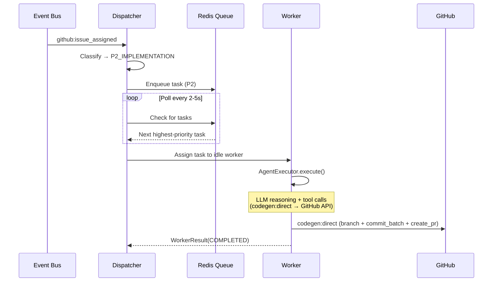

# Builder Dispatcher-Worker Architecture

The Builder agent uses a Dispatcher-Worker pattern to process multiple tasks concurrently with priority-based scheduling. This document describes the architecture, configuration, and operational behavior of the system.

---

## Why It Exists

The original Builder agent processed events sequentially — one task at a time, blocking on LLM calls. If a high-priority CI fix arrived while the Builder was mid-way through implementing a feature issue, the fix had to wait.

The Dispatcher-Worker architecture replaces that serial model with:

- **Priority queuing** — urgent tasks (CI failures, review responses) jump ahead of routine work.
- **Concurrent execution** — multiple workers run in parallel, each handling one task.
- **Timeout enforcement** — tasks that exceed their time budget are aborted, freeing the worker.
- **Redis-backed state** — task queue and state survive process restarts.
- **Queue reliability** — startup recovery, DLQ auto-retry, task dedup, capacity backpressure, and graceful shutdown re-queuing prevent task loss.

The result: the Builder can implement an issue, respond to a PR review, and fix a CI failure simultaneously, with safety-critical work always processed first.

---

## Architecture Overview

```
┌─────────────────────────────────────────────────────────┐
│                     Event Bus                           │
│  github:issue_assigned, architect:pr_review,            │
│  github:ci_fail, strategist:builder_directive, ...      │
└──────────────────────┬──────────────────────────────────┘
                       │
                       ▼
              ┌─────────────────┐
              │   Dispatcher    │
              │                 │
              │  • Classifies   │
              │    events       │
              │  • Assigns      │
              │    priority     │
              │  • Generates    │
              │    threadKey    │
              │  • Enqueues     │
              │    tasks        │
              │  • Polls queue  │
              │  • Assigns to   │
              │    idle workers │
              └────────┬────────┘
                       │
          ┌────────────┼────────────┐
          ▼            ▼            ▼
   ┌────────────┐ ┌────────────┐ ┌────────────┐
   │  Worker 1  │ │  Worker 2  │ │  Worker 3  │
   │  (busy)    │ │  (idle)    │ │  (busy)    │
   │            │ │            │ │            │
   │ implement  │ │            │ │ fix_ci     │
   │ _issue     │ │            │ │ _failure   │
   └─────┬──────┘ └────────────┘ └──────┬─────┘
         │                              │
         ▼                              ▼
  ┌─────────────┐               ┌─────────────┐
  │CodingExecutor│               │CodingExecutor│
  │ (CLI or Pi) │               │ (CLI or Pi) │
  └──────┬──────┘               └──────┬──────┘
         │                              │
   ┌─────┴──────┐                ┌─────┴──────┐
   │ AgentExec  │                │ PiCoding   │
   │ CLI spawn  │                │ Executor   │
   └────────────┘                └────────────┘
```

### Execution Paths

There are two independent axes:

**Code generation method** (how Builder produces file changes):

| Method | Action | Description |
|--------|--------|-------------|
| **Direct API** *(default)* | `codegen:direct` | Builder reads files, generates changes, commits via GitHub API — no subprocess |
| **CLI subprocess** *(fallback)* | `codegen:execute` | Clones repo, spawns CLI coding tool (Claude Code/Codex/OpenCode), runs tests |

**Worker executor** (how the worker runs the Builder LLM loop):

| Path | Mode | Description |
|------|------|-------------|
| **CLI** | `EXECUTOR_TYPE=cli` | Worker calls `AgentExecutor` → LLM reasoning + tool calls → `codegen:direct` (default) or `codegen:execute` (fallback) |
| **Pi** | `EXECUTOR_TYPE=pi` | Worker calls `PiCodingExecutor` → in-process Pi SDK session with YClaw-safe custom tools |

The worker executor path is selected per-task by `CodingExecutorRouter` based on `task.executorHint` and global `EXECUTOR_TYPE`. CLI is the default. Pi is opt-in via `PI_CODING_AGENT_ENABLED=true`.

### Components

| Component | Source File | Responsibility |
|-----------|------------|----------------|
| **Dispatcher** | `packages/core/src/builder/dispatcher.ts` | Receives events, classifies priority, generates threadKeys, enqueues tasks, polls queue, assigns to idle workers |
| **TaskQueue** | `packages/core/src/builder/task-queue.ts` | Redis-backed priority queue (ZSET per level). Handles enqueue, dequeue, state transitions, TTL cleanup |
| **CodingWorker** | `packages/core/src/builder/worker.ts` | Executes a single task via `CodingExecutorRouter`. CLI path: `AgentExecutor`. Pi path: `PiCodingExecutor` |
| **CodingExecutorRouter** | `packages/core/src/codegen/backends/executors.ts` | Selects Pi vs CLI executor per-task based on config + task hints |
| **SpawnCliExecutor** | `packages/core/src/codegen/backends/spawn-cli-executor.ts` | Wraps `AgentExecutor` as a `CodingExecutor` for the CLI fallback path |
| **PiCodingExecutor** | `packages/core/src/codegen/backends/pi-executor.ts` | In-process Pi SDK executor with YClaw-safe custom tools |
| **Types** | `packages/core/src/builder/types.ts` | Shared type definitions: `Priority`, `TaskState`, `BuilderTask`, `WorkerHandle` |
| **Backend Types** | `packages/core/src/codegen/backends/types.ts` | `CodingExecutor` interface, `SessionHandle`, `SessionState`, `HarnessType`, `TurnResult`, `SteerInput` |

---

## Priority System

Tasks are assigned a priority level when enqueued. Lower numeric value = higher priority.

| Priority | Level | Use Case | Examples |
|----------|-------|----------|----------|
| **P0** | `P0_SAFETY` | Safety and error fixes | `fix_ci_failure` — CI failures, security issues |
| **P1** | `P1_REVIEW` | Code review responses | `address_review_feedback` — Architect PR reviews |
|  |  |  | `address_human_review` — Human PR review feedback |
| **P2** | `P2_IMPLEMENTATION` | Feature implementation | `implement_issue` — GitHub issue implementation |
|  |  |  | `implement_directive` — Strategist directives |
| **P3** | `P3_BACKGROUND` | Background/maintenance | `daily_standup` — Morning standup reports |
|  |  |  | `self_reflection` — Claudeception skill extraction |

### Priority Behavior

- When the queue has tasks at multiple priority levels, the highest-priority (lowest number) task is dequeued first.
- Within the same priority level, tasks are processed in FIFO order (earliest `createdAt` first).
- A P0 task enqueued while all workers are busy on P2 tasks will be the next task assigned when any worker becomes idle. Workers do not preempt running tasks.

### Default Priority Map

```typescript
{
  fix_ci_failure:          Priority.P0_SAFETY,
  address_review_feedback: Priority.P1_REVIEW,
  address_human_review:    Priority.P1_REVIEW,
  implement_issue:         Priority.P2_IMPLEMENTATION,
  implement_directive:     Priority.P2_IMPLEMENTATION,
  daily_standup:           Priority.P3_BACKGROUND,
  self_reflection:         Priority.P3_BACKGROUND,
}
```

---

## Task Lifecycle

Every task moves through a defined set of states:

```
                  ┌──────────┐
  Event arrives → │  QUEUED  │
                  └────┬─────┘
                       │  Worker available
                       ▼
                  ┌──────────┐
                  │ ASSIGNED │
                  └────┬─────┘
                       │  Executor starts
                       ▼
                  ┌──────────┐
                  │ RUNNING  │
                  └────┬─────┘
                       │
            ┌──────────┼──────────┐
            ▼          ▼          ▼
      ┌───────────┐ ┌────────┐ ┌─────────┐
      │ COMPLETED │ │ FAILED │ │ TIMEOUT │
      └───────────┘ └────────┘ └─────────┘
```

| State | Description |
|-------|-------------|
| `QUEUED` | Task created and added to the Redis priority queue. Waiting for an idle worker. |
| `ASSIGNED` | An idle worker has claimed the task. `workerId` and `assignedAt` are set. |
| `RUNNING` | The worker's executor is actively processing (LLM calls, tool execution). |
| `COMPLETED` | Task finished successfully. The worker produced a PR, merged code, or completed its objective. |
| `FAILED` | Task encountered an unrecoverable error. The `error` field contains the failure message. |
| `TIMEOUT` | Task exceeded its `timeoutMs` budget. The abort signal was sent and the executor settled. |

### State Transitions

- **QUEUED → ASSIGNED**: Dispatcher polls the queue, finds an idle worker, dequeues the highest-priority task, and assigns it.
- **ASSIGNED → RUNNING**: The worker begins execution via `AgentExecutor.execute()` (CLI) or `PiCodingExecutor` (Pi).
- **RUNNING → COMPLETED**: Executor returns a successful result.
- **RUNNING → FAILED**: Executor throws an error or returns a failed result.
- **RUNNING → TIMEOUT**: The task's timeout fires, the abort controller signals, and the executor settles.

### Completed Task Cleanup

Completed, failed, and timed-out task records are kept in Redis with a TTL of `completedTaskTtlSecs` (default: 3600 seconds / 1 hour) for observability, then automatically expire.

### Task Registry Wiring

The Dispatcher now wires task lifecycle to the Task Registry on all terminal states (complete, fail, timeout, skip, rejection). This eliminates ghost "pending" records that previously lingered in Redis for up to 72 hours.

---

### Graceful Shutdown

On SIGTERM, the process calls `dispatcher.stopGracefully(20_000)`. This drains **all agents** (not just Builder) — every running agent task is given a chance to complete or is safely re-queued:

1. Stop accepting new tasks (`running = false`), clear all timers (poll, reaper, DLQ retry).
2. Wait up to `drainTimeoutMs` (20s) for busy workers to finish.
3. **Re-queue incomplete tasks**: Any worker still busy after the drain timeout has its current task reset to `QUEUED` (clear `workerId`/`assignedAt`, re-add to priority ZSET). The task is picked up by the next instance after deploy.

> **PR #314** expanded graceful shutdown from Builder-only to all agents, ensuring no task is lost during rolling deploys regardless of which agent owns it.

**Startup recovery**: On `dispatcher.start()`, `recoverOrphaned()` scans Redis for any `builder:task:*` keys in `QUEUED`/`ASSIGNED`/`RUNNING` state (orphaned from a previous crash) and re-enqueues them. Tasks older than `completedTaskTtlSecs` are discarded.

---

## Executor Configuration

The executor is configured under the `executor` and `taskRouting` keys in the Builder agent config:

```yaml
executor:
  type: cli               # 'cli' | 'pi'

taskRouting:
  defaults:
    executorMode: cli
  byType:
    implement_issue:
      timeoutMs: 720000       # 12 minutes
    implement_directive:
      timeoutMs: 720000       # 12 minutes
    fix_ci_failure:
      model: claude-sonnet-4-6
      timeoutMs: 180000       # 3 minutes
    daily_standup:
      executorMode: cli      # Pure reasoning — no coding session needed
    self_reflection:
      executorMode: cli
```

### Executor Environment Variables

| Variable | Value | Notes |
|----------|-------|-------|
| `EXECUTOR_TYPE` | `cli` (default) | `cli` = CLI only, `pi` = Pi SDK executor |
| `PI_CODING_AGENT_ENABLED` | `false` | Feature flag for Pi executor backend |
| `PI_CODING_AGENT_DIR` | `/tmp/pi-agent-config` | Pi SDK config directory |

### `executor.type` Behavior

| Value | Selected Executor |
|-------|-------------------|
| `cli` | CLI always |
| `pi` | Pi SDK executor (requires `PI_CODING_AGENT_ENABLED=true`) |

---

## Redis Keys

The dispatcher uses Redis for durable task state. All keys use configurable prefixes.

### Task Queue Keys (Builder Dispatcher)

| Key Pattern | Type | Description |
|-------------|------|-------------|
| `builder:task_queue:P0` | Sorted Set | P0 (safety) priority queue. Score = timestamp for FIFO within priority. |
| `builder:task_queue:P1` | Sorted Set | P1 (review) priority queue. |
| `builder:task_queue:P2` | Sorted Set | P2 (implementation) priority queue. |
| `builder:task_queue:P3` | Sorted Set | P3 (background) priority queue. |
| `builder:task:{id}` | Hash | Full task state (all `BuilderTask` fields). |
| `builder:dlq` | List | Dead-letter queue. LPUSH newest first, LTRIM to 100 entries. Entries include retry metadata. |
| `builder:dlq:archive` | List | Archived DLQ entries (purged by drain). 7-day TTL. |
| `dedup:{taskName}:{repo}:{id}` | String | Task dedup key. Value `"1"`, TTL 1 hour. SET NX to prevent duplicates. |

### Queue Mechanics

- Each priority level has its own Redis sorted set.
- The score in each sorted set is the task's `createdAt` timestamp (epoch ms), ensuring FIFO ordering within a priority.
- When polling, the dispatcher checks P0 first, then P1, P2, P3 — dequeuing the first available task from the highest-priority non-empty queue.
- Task state hashes (`builder:task:{id}`) are updated on every state transition and expire after `completedTaskTtlSecs` once the task reaches a terminal state.

---

## Dispatcher Configuration

The dispatcher is configured under the `dispatcher` key in the Builder agent config:

```yaml
dispatcher:
  enabled: true
  maxConcurrentWorkers: 3
  pollIntervalMs: 5000
  defaultTimeoutMs: 1800000  # 30 minutes
  queueKey: "builder:task_queue"
```

### Configuration Options

| Option | Type | Default | Description |
|--------|------|---------|-------------|
| `enabled` | `boolean` | `false` | Whether the dispatcher is active. When `false`, the Builder falls back to serial execution. |
| `maxConcurrentWorkers` | `number` | `3` | Maximum number of workers that can execute tasks simultaneously. |
| `pollIntervalMs` | `number` | `2000` | How often (ms) the dispatcher checks the Redis queue for new tasks. |
| `defaultTimeoutMs` | `number` | `1800000` | Default timeout per task in milliseconds (30 minutes). |
| `queueKey` | `string` | `"builder:task_queue"` | Redis key prefix for the priority queue sorted sets. |

### Internal Defaults (not exposed in YAML)

| Option | Default | Env Var | Description |
|--------|---------|---------|-------------|
| `taskKeyPrefix` | `"builder:task:"` | — | Redis key prefix for individual task state hashes. |
| `completedTaskTtlSecs` | `3600` | — | How long completed/failed/timeout task records persist in Redis. |
| `dlqRetryIntervalMs` | `300000` (5 min) | `BUILDER_DLQ_RETRY_INTERVAL_MS` | How often the DLQ retry sweep runs. |
| `dlqMaxRetries` | `3` | `BUILDER_DLQ_MAX_RETRIES` | Max retry attempts before marking a DLQ entry permanent. |
| `maxQueueDepth` | `50` | `BUILDER_MAX_QUEUE_DEPTH` | Queue depth at which all tasks except P0 are rejected. |
| `backpressureThreshold` | `30` | `BUILDER_BACKPRESSURE_THRESHOLD` | Queue depth at which P3 tasks are rejected. |

---

## Event Flow

### CLI Path (legacy)



---

## Worker Behavior

### Concurrency Model

Workers are async — they spend most of their time waiting on LLM API calls and tool execution. This means 3 workers do not require 3x CPU; they share the Node.js event loop efficiently.

Each worker:
- Has a unique ID (e.g., `worker-9f818928`)
- Manages its own `AbortController` for timeout/cancellation
- Transitions through states: `idle` → `busy` → `idle` (or `stopping` if cancelled)
- Does **not** share mutable state with other workers
- Resets to `idle` only **after** the underlying executor promise has settled

### Timeout Handling

1. When a task is assigned, a `setTimeout` is set for `task.timeoutMs`.
2. If the timeout fires before the executor completes, the `AbortController` signals abort.
3. The executor checks the abort signal between LLM rounds and tool calls.
4. The worker waits for the executor promise to settle (even after abort) before returning to `idle`.
5. The task state transitions to `TIMEOUT`.

### Per-Task Timeouts

| Task | Timeout |
|------|---------|
| `implement_issue` | 12 minutes |
| `implement_directive` | 12 minutes |
| `fix_ci_failure` | 3 minutes |
| All others | `defaultTimeoutMs` (30 minutes) |

Per-task timeouts are configured in `taskRouting.byType.<taskName>.timeoutMs` and override the global `defaultTimeoutMs`.

### Model Overrides

Some triggers specify a model override (e.g., cron-triggered `daily_standup` uses `claude-sonnet-4-20250514` instead of the default `claude-opus-4-6`). The model override is captured at enqueue time and passed to the executor, ensuring the correct model is used regardless of when the task is actually picked up by a worker.

---

## Event-to-Task Mapping

### CI Webhook Job Classification

GitHub CI webhooks are now classified by job type (Check vs Deploy vs Build) via the GitHub Jobs API. The circuit breaker uses `projectKey` with a null-key fallback to prevent bypass when the project key is null.

### Static Mapping

The dispatcher uses a static mapping to convert incoming event types to Builder task names:

| Event Type | Task Name | Priority | Default Executor |
|------------|-----------|----------|-----------------|
| `github:issue_assigned` | `implement_issue` | P2 | cli |
| `strategist:builder_directive` | `implement_directive` | P2 | cli |
| `github:pr_review_comment` | `address_review_feedback` | P1 | cli |
| `github:ci_fail` | `fix_ci_failure` | P0 | cli |
| `github:pr_review_submitted` | `address_human_review` | P1 | cli |
| `claudeception:reflect` | `self_reflection` | P3 | cli |

---

## Observability

### Dispatcher Metadata in Payloads

Every task payload includes a `_dispatcherMeta` object injected by the worker before execution:

```json
{
  "_dispatcherMeta": {
    "workerId": "worker-9f818928",
    "taskId": "4dba2f60-7c5d-4ff9-9844-b57e88091e98",
    "priority": 2
  }
}
```

### Logging

Each component logs with a namespaced logger:
- `builder-dispatcher` — queue polling, task assignment, threadKey computation
- `builder-worker` / `worker:{id}` — per-worker task execution, completion
- `builder-queue` — Redis operations, enqueue/dequeue, state transitions
- `executor-router` — Pi vs CLI selection decisions
- `spawn-cli-executor` — CLI execution
- `pi-executor` — Pi SDK executor sessions

---

## Queue Reliability

The dispatcher implements five reliability mechanisms to prevent task loss.

### Startup Recovery

On `dispatcher.start()`, the queue scans Redis for orphaned tasks using `SCAN` (not `KEYS`) with the pattern `builder:task:*`:

- **QUEUED** tasks not present in their priority ZSET → re-added.
- **ASSIGNED** or **RUNNING** tasks → reset to `QUEUED`, `workerId`/`assignedAt` cleared, re-added to ZSET.
- Tasks older than `completedTaskTtlSecs` → discarded (expired, not recovered).

### DLQ Auto-Retry

A timer runs every `dlqRetryIntervalMs` (default 5 minutes) and scans the DLQ for entries eligible for retry:

- **Eligible:** `retryCount < maxRetries` AND `nextRetryAt <= now` AND `permanent !== true`.
- **Action:** Remove from DLQ, create a new task with the same `taskName`/`priority`/`triggerPayload`, enqueue it.
- **Backoff:** `min(dlqRetryIntervalMs * 2^retryCount, 30 min)` — 5m → 10m → 20m.
- **Exhausted:** After `maxRetries` (default 3), the entry is marked `permanent: true` and left in the DLQ for manual intervention.

DLQ entries now carry retry metadata:

```typescript
interface DlqEntry {
  // ... existing fields ...
  retryCount: number;      // 0 on first failure
  nextRetryAt: string;     // ISO timestamp for next eligible retry
  maxRetries: number;      // from DispatcherConfig.dlqMaxRetries
  permanent: boolean;      // true after exhausting retries
  triggerPayload?: Record<string, unknown>;  // for re-enqueue
}
```

### Task Dedup

Before enqueuing, the dispatcher generates a dedup key from stable payload fields:

```
dedup:{taskName}:{repo}:{prNumber|issueNumber|sha}
```

The key is set via `SET key "1" EX 3600 NX` (1-hour TTL). If the key already exists, the task is suppressed as a duplicate. The key is cleared when the task completes (success or final failure).

Events with no stable identifiers (no repo, no PR/issue number, no SHA) bypass dedup.

### Capacity Backpressure

The dispatcher checks queue depth before enqueuing:

| Queue Depth | Behavior |
|------------|----------|
| `< backpressureThreshold` (30) | All tasks accepted |
| `>= backpressureThreshold` (30) | P3 (background) tasks rejected |
| `>= maxQueueDepth` (50) | All tasks except P0 (safety) rejected |

A one-time Slack alert is posted to `#yclaw-alerts` when backpressure activates. The alert resets when depth drops below the threshold.

### DLQ Alert Batching

DLQ failure alerts are batched to prevent Slack flooding when multiple tasks fail
in quick succession. Instead of posting one message per DLQ entry, the dispatcher
buffers entries and flushes as a single consolidated message:

- **Flush threshold:** 5 entries (immediate flush)
- **Flush timeout:** 60 seconds (timer flush)
- **Format:** Single message with bullet-point summary of all failed tasks
- **Shutdown:** Buffer is flushed on both `stop()` and `stopGracefully()`

### DLQ Drain

A one-shot `drainDlq()` method is available for clearing accumulated DLQ entries:

```typescript
await dispatcher.drainDlq({
  retryAll?: boolean;    // Retry all retriable entries (not just timeouts)
  purgeBefore?: string;  // ISO timestamp — purge entries older than this
  dryRun?: boolean;      // Preview without modifying DLQ
});
```

Logic:
- **Timeout errors** with `retryCount < maxRetries` → re-enqueue at P3 priority.
- **Entries > 48h old** → archive to `builder:dlq:archive` (7-day TTL).
- **Permanent errors** (missing repo, auth failures) → archive.

Triggered via: `{"agent":"builder","task":"drain_dlq"}`.

### Phase 7: Zombie Task Prevention

Zombie tasks occur when stale CI events (e.g., from branches 4+ hours old) generate P0 `fix_ci_failure` tasks that cycle through timeout → retry → DLQ → DLQ auto-retry → re-enqueue indefinitely, starving all other priorities.

Phase 7 adds a multi-layer defense against zombie accumulation:

#### Correlation ID Format

Correlation IDs follow the pattern `owner/repo:context:epoch_ms` where the trailing segment is a Unix epoch in milliseconds. The staleness gate extracts this timestamp to compute event age. IDs without a valid trailing epoch (e.g., `corr-123`) bypass staleness checks (returns null).

#### Staleness Gate

Before enqueueing, the dispatcher checks if the event's correlation ID is older than `correlationMaxAgeMs` (default: 2 hours). Stale events are rejected immediately with a log entry — they never enter the queue.

#### Correlation-Level Dedup

A Redis `SET NX` key (`dedup:corr:{correlationId}`, 2h TTL) prevents the same correlation from generating multiple queue entries. This runs after the staleness gate and before the Phase 6 event-level dedup.

#### Stale-Aware Retry

When a task times out, the dispatcher checks correlation staleness before retrying. Stale tasks skip the immediate retry and go directly to DLQ as permanent entries with an `[EXPIRED]` error tag.

#### DLQ Staleness Expiry

During DLQ retry sweeps, entries with stale correlation IDs are marked permanent — they are never retried again.

#### Startup Stale Flush

On dispatcher boot, all priority queues are scanned and tasks with stale correlation IDs are removed. This prevents zombie accumulation across rolling deploys where old tasks survive container restarts.

#### Queue Flush API

`POST /api/builder/queue/flush` provides an operational endpoint for manual zombie cleanup:

```json
{
  "taskName": "fix_ci_failure",
  "priority": 0,
  "correlationPattern": "yclaw-ai/yclaw:*",
  "flushDlq": true
}
```

All fields are optional. Returns counts of flushed tasks per queue.

#### Configuration

| Option | Default | Env Var | Description |
|--------|---------|---------|-------------|
| `correlationMaxAgeMs` | `7200000` (2h) | `BUILDER_CORRELATION_MAX_AGE_MS` | Max age for correlation IDs before events are rejected/expired. |

#### Redis Keys (Phase 7)

| Key Pattern | Type | Description |
|-------------|------|-------------|
| `dedup:corr:{correlationId}` | String | Correlation-level dedup. Value `"1"`, TTL 2 hours. SET NX. |

---

## Failure Handling

### Project Circuit Breaker

Tracks failures per project in a sliding 2-hour window. After 3 failures for the same project, new tasks are auto-rejected until the window resets. `resetProjectCircuit()` available for manual override.

### DLQ Retry Cap

Max 3 retries with exponential backoff (5m → 10m → 20m). Tasks exceeding the cap are marked `permanent: true` and excluded from auto-retry. The `failedAt` timestamp catches UUID-format correlation IDs that bypassed age-based expiry.

### Strategist Flood Guard

Rejects `strategist:builder_directive` events when Builder queue depth exceeds 15. Prevents the Strategist from overwhelming the Builder with directives during high-load periods.

---

## PR/Issue Reconciliation Loop

A self-healing reconciliation loop runs every 10 minutes, detecting 7 classes of stuck states:

1. **Stale approvals** — PRs approved but not merged within expected window
2. **Orphan PRs** — PRs with no linked task or issue
3. **Stuck CI** — CI runs that haven't completed within timeout
4. **Abandoned tasks** — Tasks in RUNNING state with no recent activity
5. **Stale reviews** — Review requests older than expected SLA
6. **Missed merges** — PRs meeting all merge criteria but not merged

The loop emits events that the ReactionsManager processes to resolve each stuck state.

---

## Source Files

### yclaw (core runtime — `packages/core/`)

| File | Path |
|------|------|
| Dispatcher | [`packages/core/src/builder/dispatcher.ts`](../packages/core/src/builder/dispatcher.ts) |
| Task Queue | [`packages/core/src/builder/task-queue.ts`](../packages/core/src/builder/task-queue.ts) |
| Worker | [`packages/core/src/builder/worker.ts`](../packages/core/src/builder/worker.ts) |
| Types (Builder) | [`packages/core/src/builder/types.ts`](../packages/core/src/builder/types.ts) |
| CLI Executor | [`packages/core/src/codegen/backends/spawn-cli-executor.ts`](../packages/core/src/codegen/backends/spawn-cli-executor.ts) |
| Pi Executor | [`packages/core/src/codegen/backends/pi-executor.ts`](../packages/core/src/codegen/backends/pi-executor.ts) |
| Executor Router | [`packages/core/src/codegen/backends/executors.ts`](../packages/core/src/codegen/backends/executors.ts) |
| Types (CodingExecutor) | [`packages/core/src/codegen/backends/types.ts`](../packages/core/src/codegen/backends/types.ts) |
| Tests (Dispatcher) | [`packages/core/tests/builder-dispatcher.test.ts`](../packages/core/tests/builder-dispatcher.test.ts) |
| Tests (Phase 6) | [`packages/core/tests/dispatcher-phase6.test.ts`](../packages/core/tests/dispatcher-phase6.test.ts) |

---

## Coordination Lifecycle Events

The Builder dispatcher emits typed coordination events via Redis Streams at 4
task lifecycle points. These events use the `YClawEvent<CoordTaskPayload>`
envelope and are published fire-and-forget — they never block task execution.

### Emission Points

| Event | Where | When |
|-------|-------|------|
| `coord.task.requested` | `handleEvent()` | Task enqueued after event received |
| `coord.task.started` | `dispatchNext()` | Worker assigned to the task |
| `coord.task.completed` | `runWorker()` | Worker returns success |
| `coord.task.failed` | `runWorker()` (result + catch) | Worker returns failure or throws |

### Payload

All events carry `CoordTaskPayload`:

```typescript
{
  task_id: string;       // BuilderTask.id
  project_id: string;    // BuilderTask.correlationId
  status: 'requested' | 'started' | 'completed' | 'failed';
  description?: string;  // BuilderTask.taskName
  assignee?: string;     // 'builder' (on started/completed/failed)
  message?: string;      // Error message (on failed)
}
```

### Publishing Pattern

Events are wrapped in `void` + try/catch to ensure they never interfere with
task execution:

```typescript
void this.deps.eventBus.publishCoordEvent(
  createEvent<CoordTaskPayload>({
    type: COORD_TASK_STARTED,
    source: 'builder',
    correlation_id: task.correlationId,
    payload: {
      task_id: task.id,
      project_id: task.correlationId,
      status: 'started',
      assignee: 'builder',
      description: task.taskName,
    },
  }),
);
```

`publishCoordEvent()` writes to Redis Streams via `EventStream.publishEvent()`.
If the EventStream is not wired (no Redis), the call is a no-op.

See [`docs/COORDINATION.md`](COORDINATION.md) for the full coordination system
reference including consumer patterns, debugging, and migration notes.
