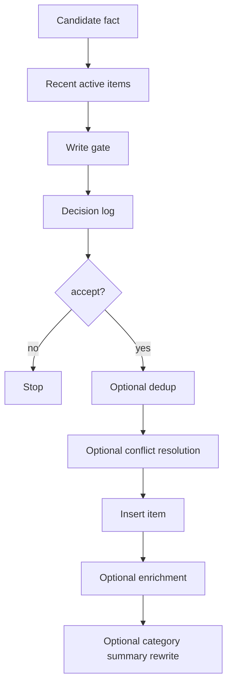

# Knowledge Vault and Structured Memory

This document is a scoped reference for the current repository state. It covers the verified relationship between the Markdown knowledge vault under `vault/` and the structured memory package under `packages/memory/`.

It intentionally does **not** restate the internals of core vault services such as `WriteGateway`, `VaultReader`, or `VaultSyncEngine`, because those implementations live outside this ownership area.

---

## Two Separate Systems

The repository has two persistence layers for agent knowledge:

| Layer | Storage | Purpose | Owned implementation |
|---|---|---|---|
| Knowledge vault | Markdown files under `vault/` | Human-readable notes, templates, research, inbox content, and skill proposals | External to this doc's owned code |
| Structured memory | PostgreSQL tables via `@yclaw/memory` | Queryable facts, categories, checkpoints, resources, triples, and episodes | `packages/memory/` |

Current boundary:

- `@yclaw/memory` does not read from `vault/` and does not write Markdown files.
- `@yclaw/memory` does not expose vault-specific tools or file-system APIs.
---

## Verified Vault Layout

The checked-in vault currently contains these top-level directories:

```text
vault/
├── .obsidian/
├── 00-org/
├── 01-projects/
├── 02-areas/
│   ├── development/
│   ├── executive/
│   ├── finance/
│   ├── marketing/
│   ├── operations/
│   └── support/
├── 03-resources/
│   ├── research/
│   ├── runbooks/
│   └── skills/
├── 04-archive/
├── 05-inbox/
│   └── skills/
├── daily/
└── templates/
```

The checked-in template files are:

```text
vault/templates/
├── daily-standup.md
├── decision.md
├── project.md
├── research.md
└── skill-proposal.md
```

This document makes no further claims about vault runtime behavior, because the file-system readers, writers, and embedding sync jobs are implemented elsewhere.

---

## What `@yclaw/memory` Owns

`packages/memory/` is a structured persistence library. It exports low-level helpers and a `MemoryManager` orchestration class.

### Phase 1 Modules

| Module | Responsibility |
|---|---|
| `working-memory.ts` | In-process scratch state keyed by `agentId:sessionId`, capped at 16 KB. |
| `write-gate.ts` | Candidate-fact classifier and accept/reject gate. |
| `items.ts` | Insert, list, archive, and confidence-update helpers for atomic facts. |
| `categories.ts` | Category visibility and mutable summary rewrite helpers. |
| `memory-manager.ts` | High-level write, recall, checkpoint, and enrichment orchestration. |

### Phase 2 Modules

| Module | Responsibility |
|---|---|
| `checkpoint.ts` | Persist and replay per-turn checkpoints. |
| `resources.ts` | Store raw source inputs and link items back to them. |
| `dedup.ts` | pgvector-based similarity merge logic. |
| `conflict-resolution.ts` | Subject/predicate conflict detection and archival of superseded items. |
| `embeddings.ts` | OpenAI-backed and null embedding services. |

### Phase 3 Modules

| Module | Responsibility |
|---|---|
| `strength.ts` | Decay, access tracking, sentiment tagging, and weak-item archival. |
| `triples.ts` | Subject-predicate-object graph storage and query helpers. |
| `episodes.ts` | Narrative grouping, closure, and embedding-based episode search. |

---

## Structured Memory Write Path

`MemoryManager.storeFact()` is the package's primary write entry point.



Verified behavior from the current implementation:

- The write gate posts directly to Anthropic's Messages API.
- Dedup runs only when a non-null embedding service is configured.
- Conflict resolution and triple extraction use heuristic pattern matching.
- Sentiment tagging, triple upsert, resource linking, conflict logging, and category rewrites are best-effort follow-up steps after the item insert.

---

## When To Use Vault vs Memory

| Need | Use | Reason |
|---|---|---|
| Durable, queryable fact storage per agent | `@yclaw/memory` | Facts, categories, checkpoints, resources, triples, and episodes live in Postgres-backed tables. |
| Human-readable notes, research, project docs, or inbox content | `vault/` | The vault is the checked-in Markdown workspace. |
| Session-local scratch data during an execution | `WorkingMemory` | It is fast, in-process, and disposable. |
| Persistent coding workspace for CLI harnesses | Codegen backends | Workspaces are ephemeral per-task, not stored in the vault. |

---

## External Gaps

The following concerns are real in the repository, but their implementations are outside the code audited for this document:

- Vault write policy and write-path enforcement
- Vault file read/search tools
- Vault embedding sync and search indexes
- Skill ingestion and trust-tier enforcement over vault content

Those behaviors should be documented alongside the owning code in `packages/core/src/knowledge/`, `packages/core/src/actions/vault.ts`, and `packages/core/src/skills/`.
