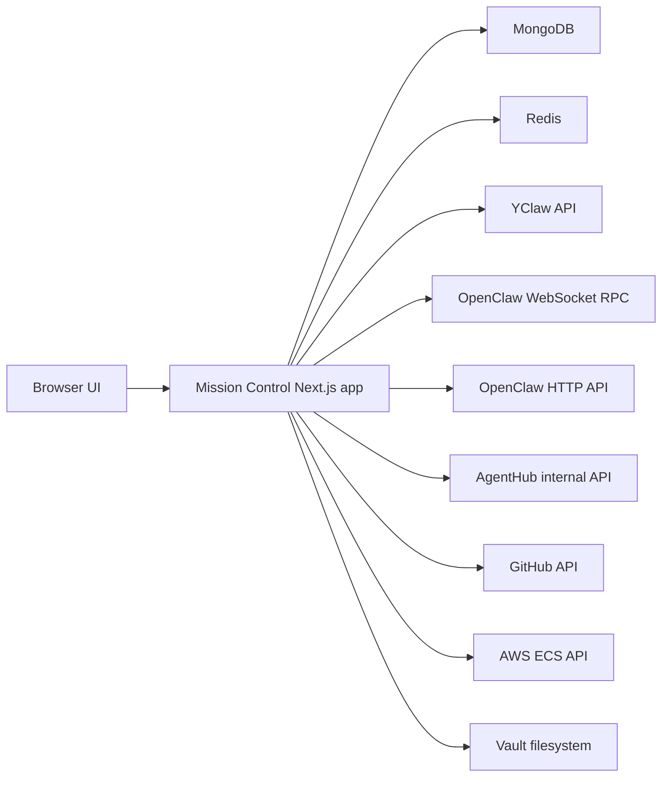
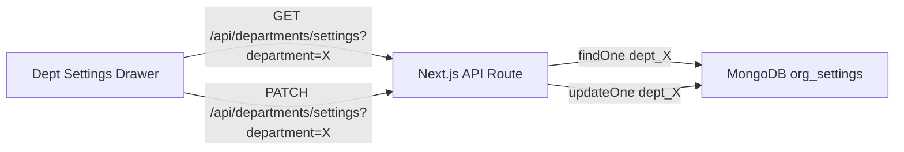
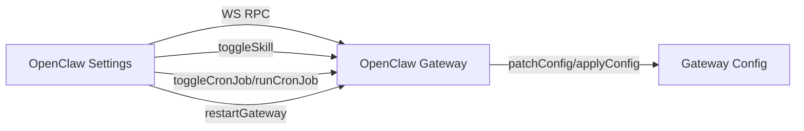
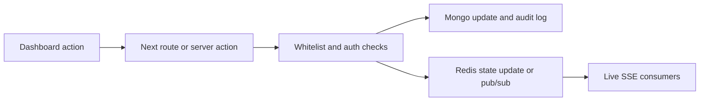

# Mission Control

> Architecture and API reference for the `packages/mission-control` Next.js application.

## Overview

Mission Control is a standalone Next.js 14 App Router package that acts as the operator console for the YClaw fleet. It is not just a chat surface. The package renders:

- A fleet overview with Hive visualization, live activity, queue depth, and top active agents
- Department dashboards for executive, development, marketing, operations, finance, and support
- OpenClaw gateway observability and controls
- Governance views for approvals, organization settings, budgets, and fleet mode
- System views for builder queues, audit feeds, and vault browsing

Code location: `packages/mission-control/`

## Runtime Model

| Property | Value |
|----------|-------|
| Framework | Next.js 14 App Router |
| Package | `@yclaw/mission-control` |
| Default local port | `3001` |
| Output mode | `standalone` |
| Runtime style | Server Components with client islands |
| Auth gate | `MC_API_KEY` cookie check in middleware |

## System Diagram



## Page Map

### Primary pages

| Route | Purpose |
|-------|---------|
| `/` | Fleet overview, Hive graph, KPI cards, live activity, quick links |
| `/openclaw` | Gateway status, sessions, channels, cron jobs, skills, models, settings drawer |
| `/events` | Live event stream overlay plus recent run feed |
| `/settings` | Global organization settings: fleet controls, connections, budget mode, provider keys, kill switch |

### Department dashboards

| Route | Key data shown |
|-------|----------------|
| `/departments/executive` | Objectives, approvals, standup synthesis, spend, heartbeat, AgentHub commits |
| `/departments/development` | PR health, builder queues, dispatcher state, budgets, AgentHub DAG |
| `/departments/marketing` | Published content, Forge assets, Scout reports, schedule-derived content calendar, AgentHub posts |
| `/departments/operations` | ECS fleet status, Sentinel audits, health checks, cache stats, memory status |
| `/departments/finance` | Treasury snapshots, wallet balances, runway, budget attention items |
| `/departments/support` | Support inbox, moderation feed, community temperature, spend |

### System pages

| Route | Purpose |
|-------|---------|
| `/system/queues` | Builder queues from Redis sorted by priority bucket |
| `/system/approvals` | Human approvals plus markdown proposals in `vault/05-inbox` |
| `/system/sessions` | Session inventory from Redis hashes |
| `/system/vault/[[...path]]` | Vault browser and markdown renderer |

### Additional pages

| Route | Purpose |
|-------|---------|
| `/operators` | Operator Management UI |

### Design Studio

- Design Studio UI (Stitch-powered) for visual design generation

### UI Notes

- Organization Settings drawer restored (4 sections)
- Fleet badge now uses modal instead of dropdown, task count removed
- SoundToggle removed from Hive
- Streaming responses auto-abort on new user message

### Redirect aliases

| Alias | Redirect target |
|-------|-----------------|
| `/agents` | `/` |
| `/approvals` | `/system/approvals` |
| `/queue` | `/system/queues` |
| `/sessions` | `/system/sessions` |
| `/treasury` | `/departments/finance` |
| `/elon` | `/openclaw` |
| `/vault/*` | `/system/vault/*` |

## Authentication and Access

Middleware protects every route except:

- `/login`
- `/api/health`
- `/api/debug/*`

When `MC_API_KEY` is configured, the login form writes an `mc_api_key` cookie and every protected request must match it. The API handlers themselves rely on middleware for session gating. Some server actions also call `verifyAuth()` defensively before mutating data.

## Data Sources

### MongoDB

Mission Control reads from and writes to these collections:

- `run_records`
- `audit_events`
- `audit_log`
- `org_settings`
- `org_settings_audit`
- `org_spend_daily`
- `treasury_snapshots`
- `agent_budgets`
- `budget_config`

### Redis

Mission Control reads or publishes against these key families and channels:

- `agent:status:*`
- `agent:executions:*`
- `builder:task_queue:*`
- `builder:task:*`
- `fleet:status`
- `fleet:mode`
- `fleet:default-model`
- `fleet:fallback-model`
- `fleet:deploy-mode`
- `fleet:flags`
- `cost:daily:*`
- `cost:monthly:*`
- `audit:events`
- `hive:events`
- `hive:agent-status`

### External services

| Service | Used for |
|---------|----------|
| YClaw API | approvals, schedules, cache stats, memory status, trigger actions |
| OpenClaw | chat completions, gateway RPC, session/channel/skill/model reads |
| AgentHub | commit DAG, leaves, channel posts |
| GitHub | repo PR and commit metadata, prompt file reads and writes |
| AWS ECS | runtime fleet desired/running count for the operations dashboard |
| Vault filesystem | vault browsing and inbox proposal review |

## API Reference

### Health and streaming

| Route | Methods | Notes |
|-------|---------|-------|
| `/api/health` | `GET` | Simple liveness response |
| `/api/events` | `GET` | SSE stream that polls MongoDB, Redis, and OpenClaw and emits deltas |
| `/api/audit` | `GET` | Queryable audit feed from `audit_events`, `org_settings_audit`, and `audit_log` |
| `/api/audit/stream` | `GET` | Redis-backed SSE stream for `audit:events` |
| `/api/hive/status` | `GET` | Snapshot of agent states and execution counts from Redis |
| `/api/hive/stream` | `GET` | Redis-backed SSE for Hive channels |

### OpenClaw and gateway

| Route | Methods | Notes |
|-------|---------|-------|
| `/api/chat` | `POST` | Sends chat requests to OpenClaw; supports streaming and image data URLs |
| `/api/gateway/health` | `GET` | Returns WebSocket gateway connection status |
| `/api/gateway/events` | `GET` | Streams live gateway events over SSE |
| `/api/gateway/rpc` | `POST` | Proxies arbitrary gateway RPC methods |
| `/api/debug/openclaw` | `GET` | Public diagnostic endpoint for health, tool invocation, and chat connectivity |

### Department and organization state

| Route | Methods | Notes |
|-------|---------|-------|
| `/api/departments/executive` | `GET` | Executive summary data |
| `/api/departments/development` | `GET` | Development summary data, GitHub state, queue sizes |
| `/api/departments/marketing` | `GET` | Marketing summary data |
| `/api/departments/operations` | `GET` | Operations summary data plus fleet status |
| `/api/departments/support` | `GET` | Support summary data |
| `/api/departments/settings` | `GET`, `PATCH` | Per-department settings stored in MongoDB |
| `/api/org/settings` | `GET`, `PATCH` | Global org settings with whitelist validation and audit writes |
| `/api/org/settings/audit` | `GET` | Paginated audit history for org settings |
| `/api/org/fleet` | `GET`, `PUT` | Fleet mode, model defaults, deploy mode, and feature flags via Redis |
| `/api/org/spend` | `GET` | Monthly spend summary and projection |
| `/api/budget/config` | `GET`, `PATCH` | Global budget mode and thresholds |

### Content and file access

| Route | Methods | Notes |
|-------|---------|-------|
| `/api/org/files/[filename]` | `GET`, `PUT` | Reads and writes markdown files under `prompts/` through GitHub Contents API |
| `/system/vault/raw/[[...path]]` | `GET` | Downloads a vault markdown file directly from disk |

## OpenClaw Integration

Mission Control currently uses two integration paths:

1. WebSocket RPC through `src/lib/gateway-ws.ts` for status, sessions, channels, skills, cron, and config.
2. HTTP through `src/lib/openclaw.ts` and `/api/chat` for chat completions and multimodal message sending.

The code defaults are:

- `OPENCLAW_URL`: Set via environment variable (Tailscale `.ts.net` hostname)
- `GATEWAY_WS_URL`: Set via environment variable (Tailscale `.ts.net` hostname)

The debug route falls back to the `OPENCLAW_URL` env var when set, so treat that HTTP path as a diagnostic fallback, not the main architecture contract.

If device-auth environment variables are present, the WebSocket client signs the gateway challenge with the configured keypair. If `GATEWAY_SKIP_DEVICE_AUTH` is set, the client can connect without that step.

## Settings Surfaces

Mission Control has three distinct settings surfaces, each with its own data flow:

### 1. Department Settings Drawers (per-department)

Each department dashboard has a settings drawer that reads and writes **MongoDB `org_settings`** documents keyed by `dept_{name}`.

| Department | Component | MongoDB Document |
|------------|-----------|------------------|
| Executive | `ExecutiveSettings` | `org_settings._id: "dept_executive"` |
| Development | `DevelopmentSettings` | `org_settings._id: "dept_development"` |
| Marketing | `MarketingSettings` | `org_settings._id: "dept_marketing"` |
| Operations | `OperationsSettings` | `org_settings._id: "dept_operations"` |
| Finance | `FinanceSettings` | `org_settings._id: "dept_finance"` |
| Support | `SupportSettings` | `org_settings._id: "dept_support"` |

**Data flow:**


**Hooks:**
- `useDepartmentSettings(department)` — client-side hook that loads and saves department settings via the REST API. Manages loading, saving, and error states.
- `useDeptSaveState(department)` — shared save state management (dirty tracking, save animation, error display). Resolves department name from the explicit param or the drawer label.

**What flows through to core runtime (via SettingsOverlay):**
- Department directives
- Per-agent model and temperature overrides
- Cron and event toggle states

**What saves to MongoDB but is not yet read by core:**
- Brand assets, engagement limits, SLA targets, notification preferences, escalation rules

### 2. OpenClaw Settings Drawer

The OpenClaw page (`/openclaw`) has a settings drawer that communicates directly with the **OpenClaw Gateway via WebSocket RPC**.

**Data flow:**


**Hook:** `useOpenClawActions({ skills })` — shared hook (extracted in PR #412) that encapsulates all OpenClaw server action calls (model/temp save, skill toggle, cron run/toggle, restart). Used by both `OpenClawSettingsDrawer` and `OrgSidecar`.

### 3. Global Settings Page (`/settings`)

The `/settings` page renders `GlobalSettingsContent` which reads from **multiple backends**:

| Section | Backend | API |
|---------|---------|-----|
| Organization (name, logo, timezone) | MongoDB `org_settings` | `GET/PATCH /api/org/settings` |
| Fleet controls (mode, model, deploy) | Redis | `GET/PUT /api/org/fleet` |
| Connections (Mongo, Redis, OpenClaw) | Server-side env checks + live tests | N/A (server component) |
| Budget mode | MongoDB `budget_config` | `GET/PATCH /api/budget/config` |
| Kill switch | ECS API | `scaleEcsFleet(0)` server action |

Connection checks run automatically on page load (Redis ping, OpenClaw health).

## Config Bridge: MC → Core Runtime

The **SettingsOverlay** (`packages/core/src/config/settings-overlay.ts`) is the bridge that makes Mission Control settings affect agent behavior at runtime. Introduced in PR #410.

### Settings Hierarchy

```
YAML agent config (base)
  ↓ overridden by
MongoDB department overrides (SettingsOverlay)
  ↓ overridden by
Trigger-level modelOverride (from YAML triggers)
```

YAML trigger-level `modelOverride` always takes precedence over MC overrides.

### How It Works

```mermaid
flowchart LR
    MC[MC Dept Settings] -->|PATCH| API[/api/departments/settings]
    API -->|upsert| Mongo[MongoDB org_settings dept_X]
    Mongo -->|read with 5-min cache| SO[SettingsOverlay]
    SO -->|getAgentOverrides| Exec[AgentExecutor.execute]
    Exec -->|apply model, temp, directive| LLM[LLM Call]
    SO -->|cronEnabled check| Cron[Cron Handler]
```

1. **SettingsOverlay** reads `org_settings` with a 5-minute cache TTL (matches BudgetEnforcer).
2. **AgentExecutor** calls `settingsOverlay.getAgentOverrides(department, agentName)` before each execution.
3. Applies overrides to the effective config:
   - **Model/temperature**: merged into the agent config before manifest build
   - **Directive**: prepended to system prompt context as `## Department Directive (from Mission Control)`
   - **Cron toggles**: checked in cron handler — disabled tasks are skipped with a log message
4. If MongoDB is unavailable, graceful degradation — YAML defaults are used.

### DepartmentOverrides Schema

```typescript
interface DepartmentOverrides {
  directive?: string;
  agents?: Record<string, {
    model?: string;
    temperature?: number;
    cronEnabled?: Record<string, boolean>;
    eventEnabled?: Record<string, boolean>;
  }>;
}
```

## Data Flow Highlights

### Fleet overview

```mermaid
flowchart LR
    Runs[Mongo run_records] --> Home[/ page]
    Sessions[Redis sessions] --> Home
    Queues[Redis builder queues] --> Home
    ECS[ECS Fleet Status] --> Home
    Home --> Hive[Hive visualization]
    Home --> Activity[Live activity feed]
    Home --> Alerts[Alert count 24h]
```

### Governance writes



### Department settings flow

```mermaid
flowchart LR
    Drawer[Dept Settings Drawer] -->|useDepartmentSettings| API[/api/departments/settings]
    API -->|PATCH| Mongo[MongoDB org_settings]
    Mongo -->|5-min cached read| SO[SettingsOverlay in core]
    SO -->|model, temp, directive, toggles| Exec[Agent Execution]
```

## Environment Variables

### Required for core functionality

- `MC_API_KEY`
- `MONGODB_URI`
- `REDIS_URL`
- `OPENCLAW_GATEWAY_TOKEN`
- `VAULT_PATH`

### Required for specific integrations

- `OPENCLAW_URL`
- `GATEWAY_WS_URL`
- `GATEWAY_DEVICE_PUBLIC_KEY`
- `GATEWAY_DEVICE_PRIVATE_KEY`
- `GATEWAY_DEVICE_FINGERPRINT`
- `GATEWAY_SKIP_DEVICE_AUTH`
- `YCLAW_API_URL`
- `YCLAW_API_KEY`
- `GITHUB_TOKEN`
- `MISSION_CONTROL_APPROVER_ID`
- `AGENTHUB_INTERNAL_URL`
- `AGENTHUB_MC_API_KEY`
- `WALLET_CONFIG`
- `SOLANA_RPC_URL`
- `ETH_RPC_URL`
- `NEXT_PUBLIC_YCLAW_API_URL`
- `NEXT_PUBLIC_OPENCLAW_URL`

## Build and Runtime Notes

The package Dockerfile performs a workspace-aware build:

1. Install repo dependencies needed for Mission Control.
2. Build `packages/memory`.
3. Build `packages/core`.
4. Build `packages/mission-control`.
5. Run the standalone Next.js server on port `3001`.

`next.config.mjs` externalizes `ws`, `bufferutil`, and `utf-8-validate`, so the runtime image copies `ws` explicitly.

### Deployment

ECS service name: `yclaw-mc-production` (renamed from `yclaw-mission-control-production`).

## Verified Gaps from the Previous Doc

The previous version of this document was materially outdated. It no longer matched the code in these areas:

- It described Mission Control as a small monitoring and chat app, but the package now includes department dashboards, vault browsing, approvals, sessions, and governance APIs.
- It documented only a narrow OpenClaw HTTP path, while the package now uses both WebSocket RPC and HTTP integrations.
- It omitted most of the current API surface, including `/api/org/*`, `/api/gateway/*`, `/api/hive/*`, and `/api/departments/*`.
- It included deployment and network specifics that are not supported by the current package code.
