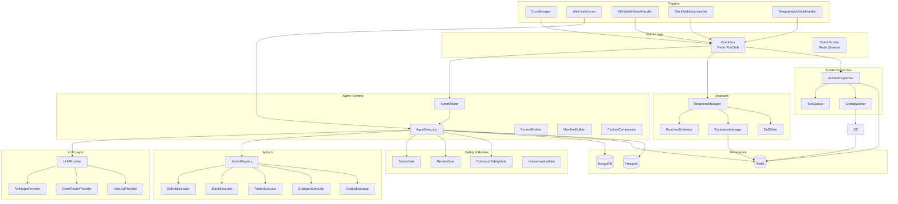
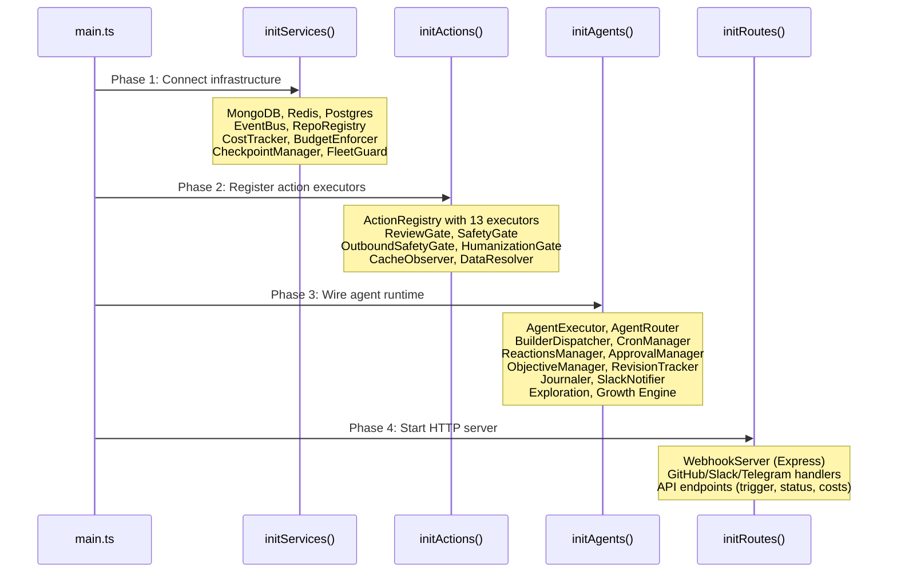
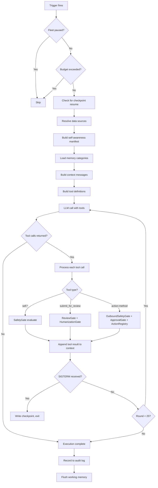

# @yclaw/core

Runtime engine for the YClaw autonomous agent system. This package loads agent configurations (YAML), orchestrates LLM-driven execution loops, manages inter-agent communication via a Redis event bus, and exposes an HTTP API for webhooks, manual triggers, and observability.

## Table of Contents

- [Installation](#installation)
- [Quick Start](#quick-start)
- [Architecture Overview](#architecture-overview)
- [Module Map](#module-map)
- [Bootstrap Sequence](#bootstrap-sequence)
- [Agent Execution Flow](#agent-execution-flow)
- [API Reference](#api-reference)
  - [Agent Runtime](#agent-runtime)
  - [Configuration](#configuration)
  - [LLM Providers](#llm-providers)
  - [Event Bus](#event-bus)
  - [Triggers](#triggers)
  - [Actions](#actions)
  - [Reactions](#reactions)
  - [Builder Dispatcher](#builder-dispatcher)
  - [Codegen](#codegen)
  - [Review and Safety](#review-and-safety)
  - [Cost Tracking](#cost-tracking)
  - [Logging and Audit](#logging-and-audit)
  - [Knowledge Vault](#knowledge-vault)
  - [Exploration and Growth Engine](#exploration-and-growth-engine)
  - [Shared Contracts](#shared-contracts)
  - [Utilities](#utilities)
- [HTTP Endpoints](#http-endpoints)
- [Environment Variables](#environment-variables)
- [Testing](#testing)

---

## Installation

```bash
npm install
npm run build
```

The package is private (`"private": true`) and consumed within the monorepo. It produces ESM output at `dist/index.js` with TypeScript declarations at `dist/index.d.ts`.

## Quick Start

```bash
# Start the full agent runtime
npm start

# Development mode with file watching
npm run dev --workspace=packages/core

# Type check
npm run lint --workspace=packages/core

# Run tests
npm test --workspace=packages/core
```

The runtime reads agent YAML configs from `departments/`, system prompts from `prompts/`, and connects to MongoDB, Redis, and Postgres on startup.

---

## Architecture Overview



---

## Module Map

The `src/` directory contains 30 submodules organized by concern:

| Directory | Purpose |
|---|---|
| `actions/` | Tool executors (GitHub, Slack, Twitter, Telegram, email, codegen, deploy, Figma, Flux, video) |
| `actions/deploy/` | Deploy executors per platform (Vercel, ECS, GitHub Pages) with risk schemas |
| `actions/github/` | GitHub API operations (PRs, issues, files, repos) |
| `agent/` | Agent executor, router, context builder, manifest builder, prompt snapshots, cache metrics |
| `agent/middleware/` | Context compression middleware |
| `agenthub/` | AgentHub client, promoter, and type definitions |
| `approvals/` | Approval workflow manager, gate definitions, and types |
| `bootstrap/` | Startup initialization: services, actions, agents, routes |
| `builder/` | Builder dispatcher, task queue, coding worker, session store, thread key generation |
| `checkpoint/` | Session checkpoint manager for SIGTERM resume |
| `codegen/` | Workspace provisioner, secrets management, codegen types |
| `codegen/backends/` | Coding executors: ACP, CLI spawn, Claude, Codex, OpenCode, router |
| `config/` | Config loader, schema (Zod), repo registry, repo schema, repo loader |
| `config-revisions/` | Agent config revision tracker and diff engine |
| `contracts/` | Shared Zod-validated types (sessions, runs, events, approvals, thread keys) |
| `costs/` | Cost tracker, budget enforcer, model pricing, treasury snapshots |
| `data/` | Data resolver (fetches live data sources before LLM runs) |
| `deploy/` | Deploy governance: file risk classifier, risk assessment integration |
| `exploration/` | Exploration module: dispatcher, worker, reviewer, poller |
| `growth-engine/` | Marketing experiment engine: scorer, mutator, propagator, compliance, channels |
| `knowledge/` | Knowledge vault: write gateway, vault reader, vault sync |
| `llm/` | LLM provider abstraction: Anthropic, OpenRouter, LiteLLM |
| `logging/` | Winston logger, MongoDB audit log, cache observer |
| `modules/` | Cross-cutting modules: Journaler (GitHub comments), SlackNotifier |
| `objectives/` | Objective hierarchy manager, stale loop detector |
| `reactions/` | Declarative lifecycle automation: manager, evaluator, escalation, rules, DoD gate |
| `review/` | Content review: reviewer gate, outbound safety, humanizer |
| `safety/` | Hard gate runner (CI-protected) |
| `security/` | Memory write scanner |
| `self/` | Self-modification tools, safety gate, agent memory, git persistence |
| `services/` | Event stream (Redis Streams), heartbeat checker |
| `triggers/` | Cron, event bus, webhooks (GitHub, Slack, Telegram), batch collector, event schemas |
| `types/` | Typed coordination event definitions (YClawEvent envelope) |
| `utils/` | Token estimator, Slack Block Kit helpers |

---

## Bootstrap Sequence

The application starts in `main.ts` and initializes in four phases:



**Graceful shutdown** runs three phases when SIGTERM/SIGINT arrives:
1. Stop accepting new work (cron, reactions, router)
2. Drain in-flight executions (15s timeout for dispatcher + router)
3. Close connections (EventBus, FleetGuard, AuditLog)

---

## Agent Execution Flow

When an agent runs (via cron, event, webhook, or manual trigger), `AgentExecutor.execute()` drives this loop:



**Key behaviors:**
- Maximum 25 tool rounds per execution
- Read-only actions (`github:get_contents`) are deduplicated within an execution
- Base64 data in tool results is truncated to prevent context overflow
- Cost events are recorded after every LLM round
- Checkpoints are saved after each tool round (Postgres) and on SIGTERM (Redis)

---

## API Reference

### Agent Runtime

#### `AgentExecutor`

The central execution engine. Runs one agent task end-to-end.

```typescript
import { AgentExecutor } from '@yclaw/core';

const executor = new AgentExecutor(
  auditLog,      // AuditLog
  selfModTools,  // SelfModTools
  safetyGate,    // SafetyGate
  reviewGate,    // ReviewGate
  outboundSafety,// OutboundSafetyGate
  actionRegistry,// ActionRegistry
  eventBus,      // EventBus
  memoryIndex,   // MemoryIndexLike (optional)
  dataResolver,  // DataResolver (optional)
  memoryManager, // MemoryManager (optional)
);

// Optional subsystem wiring
executor.setHumanizationGate(humanizationGate);
executor.setCostTracker(costTracker);
executor.setBudgetEnforcer(budgetEnforcer);
executor.setCheckpointManager(checkpointManager);
executor.setApprovalManager(approvalManager);
executor.setObjectiveManager(objectiveManager);
executor.setStaleLoopDetector(staleLoopDetector);
executor.setRouter(router);

const record = await executor.execute(
  config,          // AgentConfig
  'task_name',     // task name
  'cron',          // trigger type: 'cron' | 'event' | 'webhook' | 'manual'
  payload,         // trigger payload (optional)
  modelOverride,   // ModelConfig override (optional)
  abortSignal,     // AbortSignal (optional)
  promptsOverride, // string[] of prompt filenames (optional)
);
// Returns: ExecutionRecord
```

#### `AgentRouter`

Loads all agent YAML configs and routes triggers to agents.

```typescript
import { AgentRouter } from '@yclaw/core';

const router = new AgentRouter();  // auto-loads from departments/

router.getConfig('builder');       // AgentConfig | undefined
router.getAllConfigs();             // Map<string, AgentConfig>
router.routeEvent('forge', 'asset_ready'); // RouteMatch[]
router.routeCron('sentinel', 'health_check'); // RouteMatch | null
router.routeWebhook('/hooks/deploy'); // RouteMatch | null
router.getAllCronTriggers();        // Array<{agent, task, schedule, model?, prompts?}>
router.getAllEventSubscriptions();  // Map<eventKey, agentName[]>
router.getAllWebhookRoutes();       // Array<{path, agent, task}>
router.beginShutdown();
await router.drainExecutions(15_000);
```

#### `ContextBuilder`

Assembles the LLM message array from system prompts, manifest, task instructions, memory, and trigger payload.

```typescript
import { ContextBuilder } from '@yclaw/core';

const ctx = new ContextBuilder();
const messages = await ctx.buildMessages(
  config, manifest, taskName, triggerPayload, memoryIndex, memoryCategories,
);
```

#### `ManifestBuilder`

Builds a self-awareness manifest injected into every agent's context. Includes the agent's config, org chart, execution history, and runtime metadata.

```typescript
import { ManifestBuilder } from '@yclaw/core';

const mb = new ManifestBuilder(auditLog);
const manifest = await mb.build(config); // AgentManifest
```

#### `ContextCompressor`

Middleware that compresses long conversation histories to save tokens. Enabled via `FF_CONTEXT_COMPRESSION=true`.

```typescript
import { ContextCompressor } from '@yclaw/core';

const compressor = new ContextCompressor();
const result = await compressor.maybeCompress(messages, modelName, { eventBus, agentId });
// result: { compressed: boolean, messages, tokensSaved, turnsCompressed }
```

---

### Configuration

#### `AgentConfigSchema` (Zod)

Validates agent YAML configs. Key fields:

| Field | Type | Description |
|---|---|---|
| `name` | `string` | Lowercase agent identifier (`/^[a-z_]+$/`) |
| `department` | `enum` | `executive`, `marketing`, `operations`, `development`, `finance`, `support` |
| `model` | `ModelConfig` | Provider, model name, temperature, maxTokens |
| `system_prompts` | `string[]` | Prompt markdown filenames loaded from `prompts/` |
| `triggers` | `Trigger[]` | Cron, event, webhook, manual, or batch_event triggers |
| `actions` | `string[]` | Permitted action names (e.g., `github:create_pr`) |
| `event_subscriptions` | `string[]` | Event patterns to listen to (e.g., `forge:asset_ready`) |
| `data_sources` | `DataSource[]` | Live data fetched before each execution |
| `executor` | `ExecutorConfig?` | ACP/CLI executor settings for coding agents |
| `taskRouting` | `TaskRouting?` | Per-task-type model, executor, and TTL overrides |

#### Config Loader

```typescript
import { loadAgentConfig, loadAllAgentConfigs, loadPrompt, buildOrgChart } from '@yclaw/core';

const config = loadAgentConfig('builder');       // single agent
const all = loadAllAgentConfigs();               // Map<string, AgentConfig>
const prompt = loadPrompt('builder-system.md');  // cached, mtime-invalidated
const orgChart = buildOrgChart(all);             // OrgChart
```

#### Repo Registry

Dual-source registry: static YAML files (`repos/*.yaml`) merged with MongoDB dynamic configs. YAML always takes precedence.

```typescript
import { RepoRegistry } from '@yclaw/core';

const registry = new RepoRegistry();
await registry.initialize(db);        // db: MongoDB Db | null

registry.get('my-app');               // RepoConfig | undefined
registry.getByFullName('Org/my-app'); // RepoConfig | undefined
registry.getAll();                    // Map<string, RepoConfig>
registry.has('my-app');               // boolean
await registry.register(rawConfig);   // dynamic registration (persists to MongoDB)
```

---

### LLM Providers

```typescript
import { createProvider } from '@yclaw/core';

const provider = createProvider({ provider: 'anthropic', model: 'claude-sonnet-4-20250514', temperature: 0.7, maxTokens: 4096 });

const response = await provider.chat(messages, {
  model: 'claude-sonnet-4-20250514',
  temperature: 0.7,
  maxTokens: 4096,
  tools,
  cacheStrategy: 'system_and_3', // Anthropic prompt caching
});
// response: { content, toolCalls, usage: { inputTokens, outputTokens, cacheReadInputTokens?, cacheCreationInputTokens? } }
```

Supported providers:
- **AnthropicProvider** -- Direct Anthropic API
- **OpenRouterProvider** -- OpenRouter proxy
- **LiteLLMProvider** -- LiteLLM proxy with fallback to direct provider

Provider instances are cached by `provider:model` key.

---

### Event Bus

Redis pub/sub event bus for inter-agent communication. Falls back to local dispatch when Redis is unavailable.

```typescript
import { EventBus } from '@yclaw/core';

const bus = new EventBus(process.env.REDIS_URL);

// Publish
await bus.publish('builder', 'pr_ready', { pr_url: '...' }, correlationId);

// Subscribe with pattern matching
bus.subscribe('builder:pr_ready', async (event) => { /* AgentEvent */ });
bus.subscribe('forge:*', handler);   // all events from 'forge'
bus.subscribe('*:pr_ready', handler); // 'pr_ready' from any source
bus.subscribe('*:*', handler);        // all events

// Unsubscribe
bus.unsubscribe('builder:pr_ready', handler);
bus.unsubscribe('builder:pr_ready'); // remove all handlers for pattern

// Coordination events (Redis Streams, dual-mode)
bus.setEventStream(eventStream);
await bus.publishCoordEvent(yclawEvent);

await bus.close();
```

---

### Triggers

#### `CronManager`

Schedules recurring agent tasks using cron expressions.

```typescript
import { CronManager } from '@yclaw/core';

const cron = new CronManager();
cron.schedule('sentinel', '*/5 * * * *', 'health_check', async () => { /* ... */ });
cron.stopAll();
cron.listSchedules(); // current schedule listing
```

#### `WebhookServer`

Express-based HTTP server for incoming webhooks and API endpoints.

```typescript
import { WebhookServer } from '@yclaw/core';

const server = new WebhookServer(3000);
server.registerRoute('/api/trigger', 'POST', async (body) => { return { ok: true }; });
await server.start();
await server.stop();
server.getExpressApp(); // raw Express app for custom middleware
```

#### `GitHubWebhookHandler`

Normalizes GitHub webhook payloads into internal event types and publishes them to the event bus.

```typescript
import { GitHubWebhookHandler } from '@yclaw/core';

const handler = new GitHubWebhookHandler(eventBus, { registry: repoRegistry });
await handler.handleWebhook(eventType, payload, deliveryId);
```

Normalized events: `github:ci_pass`, `github:ci_fail`, `github:pr_opened`, `github:pr_review_submitted`, `github:pr_merged`, `github:issue_opened`, `github:issue_assigned`.

#### `SlackWebhookHandler`

Processes Slack Events API payloads and publishes normalized events.

```typescript
import { SlackWebhookHandler } from '@yclaw/core';

const handler = new SlackWebhookHandler(eventBus);
await handler.handleWebhook(body, rawBody, signature, timestamp);
```

---

### Actions

Actions are tool calls available to agents. Each action executor handles a namespace prefix (e.g., `github:*`, `slack:*`).

#### `ActionRegistry` Interface

```typescript
interface ActionRegistry {
  register(prefix: string, executor: ActionExecutor): void;
  execute(actionName: string, params: Record<string, unknown>): Promise<ActionResult>;
  listActions(): string[];
  getExecutor(prefix: string): ActionExecutor | undefined;
}

interface ActionResult {
  success: boolean;
  data?: Record<string, unknown>;
  error?: string;
}
```

#### Registered Executors

| Prefix | Executor | Capabilities |
|---|---|---|
| `twitter` | `TwitterExecutor` | Post tweets, manage threads |
| `telegram` | `TelegramExecutor` | Send messages, manage channels |
| `slack` | `SlackExecutor` | Post messages (with dedup), channel management |
| `github` | `GitHubExecutor` | PRs, issues, files, commits, repos |
| `email` | `EmailExecutor` | Send emails |
| `event` | `EventActionExecutor` | Publish events to the event bus |
| `codegen` | `CodegenExecutor` | Run codegen sessions on target repos |
| `deploy` | `DeployExecutor` | Assess and execute deployments |
| `repo` | `RepoExecutor` | Repo registry operations |
| `x` | `XSearchExecutor` | X/Twitter search |
| `flux` | `FluxExecutor` | Image generation |
| `figma` | `FigmaExecutor` | Figma design operations |
| `video` | `VideoExecutor` | Video generation |
| `task` | `TaskExecutor` | Task state management |
| `vault` | `VaultExecutor` | Knowledge vault operations |

---

### Reactions

Declarative lifecycle automation for GitHub events. When a GitHub webhook fires, the `ReactionsManager` evaluates rules, checks conditions and safety gates, and executes actions.

```typescript
import { ReactionsManager, DEFAULT_REACTION_RULES, ReactionEvaluator, EscalationManager } from '@yclaw/core';
```

#### Default Reaction Rules

| Rule | Trigger | Action |
|---|---|---|
| `ci-failed-on-pr` | `github:ci_fail` | Trigger Builder to fix CI; escalate after 30 min |
| `changes-requested` | `github:pr_review_submitted` (changes_requested) | Trigger Builder; escalate after 30 min |
| `auto-merge-on-ci-pass` | `github:ci_pass` | Auto-merge if approved + CI green + DoD passes |
| `auto-merge-on-approval` | `github:pr_review_submitted` (approved) | Auto-merge if CI green + DoD passes |
| `pr-merged-close-issues` | `github:pr_merged` | Close linked issues |
| `new-issue-auto-assign` | `github:issue_opened` | Auto-assign `agent-work` issues to Builder |

#### Definition of Done (DoD) Gate

```typescript
import { evaluateDoDGate, hasTestCoverage, findImmutableViolations } from '@yclaw/core';

const result = await evaluateDoDGate(context);
// result: { passed, checks: DoDCheck[] }
```

Checks: `ci_passing`, `type_check`, `review_approval`, `tests_exist`, `no_immutable_changes`, `auto_retry_scope`.

#### Escalation Manager

Durable timers backed by Redis ZSET. Survives ECS task restarts.

```typescript
import { EscalationManager } from '@yclaw/core';

const em = new EscalationManager(redis);
await em.schedule(ruleId, 30 * 60 * 1000, action, context);
await em.cancel(ruleId, context);
await em.processDue(); // polls every 30s
```

---

### Builder Dispatcher

Priority-queue task dispatcher for the Builder agent. Manages concurrent workers, distributed locks, and dead-letter queue.

```typescript
import { BuilderDispatcher, TaskQueue, CodingWorker, Priority } from '@yclaw/core';

const dispatcher = new BuilderDispatcher(
  { redis, executor, eventBus, builderConfig, fleetGuard },
  { maxConcurrentWorkers: 3 },
);
dispatcher.start();

await dispatcher.enqueueTask({ taskName: 'implement_feature', modelOverride });
await dispatcher.handleEvent('github:ci_fail', event);
const metrics = await dispatcher.getMetrics();
const status = dispatcher.getStatus();
await dispatcher.stopGracefully(15_000);
```

**Priority levels:** `P0` (critical) > `P1` (high) > `P2` (normal) > `P3` (low).

---

### Codegen

Workspace provisioner and coding backend router for multi-repo code generation.

```typescript
import { WorkspaceProvisioner, BackendRouter } from '@yclaw/core';
import type { CodegenSessionResult, CodegenExecuteParams } from '@yclaw/core';

import { SpawnCliExecutor, CodingExecutorRouter } from '@yclaw/core';
```

#### Workspace Lifecycle

```
clone repo -> create branch -> provision CLAUDE.md + skills -> execute backend -> collect results -> push -> cleanup
```

States: `creating` -> `cloning` -> `provisioning` -> `executing` -> `collecting` -> `pushing` -> `cleaning`.

---

### Review and Safety

Three-layer safety system: self-modification gate, outbound content filter, and review gate.

#### `SafetyGate`

Classifies self-modification requests into safety tiers: `auto_approved`, `agent_reviewed`, `human_reviewed`.

```typescript
import { SafetyGate } from '@yclaw/core';

const gate = new SafetyGate();
const level = gate.classify(method, args); // SafetyLevelType
const approved = await gate.evaluate(modification); // boolean
```

#### `ReviewGate`

Brand-voice review for outbound content. Checks tone, regulatory compliance, and platform-specific rules.

```typescript
import { ReviewGate } from '@yclaw/core';

const gate = new ReviewGate();
await gate.initialize();
const result = await gate.review(reviewRequest); // { approved, flags, severity, rewrite }
```

#### `OutboundSafetyGate`

Last line of defense before content reaches external platforms. Blocks financial advice, price predictions, hype language, internal leaks, and regulatory red flags.

```typescript
import { OutboundSafetyGate } from '@yclaw/core';

const gate = new OutboundSafetyGate();
const result = await gate.check(agentName, actionName, args);
// result: { safe: boolean, reason?: string, details?: string[] }
```

#### `HumanizationGate`

Rewrites AI-generated patterns into natural human prose before publishing.

```typescript
import { HumanizationGate } from '@yclaw/core';

const gate = new HumanizationGate();
await gate.initialize();
const result = await gate.humanize({ content, agent, contentType, targetPlatform, metadata });
// result: { changed, original, humanized, patternsFound, humanizedAt }
```

---

### Cost Tracking

Per-agent cost tracking with budget enforcement. Records every LLM call and supports daily/monthly aggregation.

```typescript
import { CostTracker, BudgetEnforcer, computeCostCents, MODEL_PRICING } from '@yclaw/core';

// Record a cost event
const tracker = new CostTracker(db, redis);
await tracker.initialize();
await tracker.record({
  agentId: 'builder', department: 'development', taskType: 'implement',
  executionId, modelId: 'claude-sonnet-4-20250514', provider: 'anthropic',
  inputTokens: 1000, outputTokens: 500,
  cacheReadTokens: 800, cacheWriteTokens: 200,
  latencyMs: 3000,
});

// Query costs
const result = await tracker.queryCosts({ agentId: 'builder', from, to });
// result: { totalCents, byAgent, byDepartment, byDay, events }

// Budget enforcement
const enforcer = new BudgetEnforcer(db, redis, tracker, eventBus);
await enforcer.initialize();
const check = await enforcer.check('builder');
// check: { allowed: boolean, reason?: string }
```

---

### Logging and Audit

#### Winston Logger

Structured logging with console (colorized) and file transports.

```typescript
import { createLogger } from '@yclaw/core';

const logger = createLogger('my-module');
logger.info('Something happened', { key: 'value' });
logger.error('Failed', { error: err.message, stack: err.stack });
```

Configured via environment:
- `YCLAW_LOG_LEVEL` -- logging level (default: `info`)
- `YCLAW_LOG_DIR` -- log file directory (default: `./logs`)

#### Audit Log

MongoDB-backed audit trail for executions, self-modifications, reviews, deployments, and codegen sessions.

```typescript
import { AuditLog } from '@yclaw/core';

const log = new AuditLog(mongoUri, dbName);
await log.connect();
await log.recordExecution(record);
await log.recordSelfModification(modification);
await log.recordReview(request, result);
await log.getAgentStats(agentName);
await log.getDeploymentHistory(repo);
await log.disconnect();
```

#### Cache Observer

Tracks Anthropic prompt caching performance across agents. Generates per-agent and org-wide reports.

```typescript
import { CacheObserver } from '@yclaw/core';

const observer = new CacheObserver(auditLog);
const report = await observer.getAgentReport('builder', from, to, model);
const orgReport = await observer.getOrgReport(agentNames, from, to);
const summary = CacheObserver.formatApiSummary(orgReport);
```

---

### Knowledge Vault

File-based knowledge vault with git persistence and security scanning.

#### `WriteGateway`

Accepts structured content proposals, validates them through the `MemoryWriteScanner`, writes to the vault filesystem, and optionally commits via git.

```typescript
import { WriteGateway } from '@yclaw/core';
import type { ProposalInput, ProposalResult } from '@yclaw/core';

const gw = new WriteGateway(config, scanner);
const result = await gw.propose({
  content: '...',
  template: 'decision',
  metadata: { agentName: 'architect', title: 'Use ESM modules' },
});
// result: { id, filePath, blocked, issues }
```

#### `VaultReader`

Searches and reads vault content.

```typescript
import { VaultReader } from '@yclaw/core';

const reader = new VaultReader(config);
const results = await reader.search(query);
```

#### `VaultSyncEngine`

Syncs vault content to Redis for fast lookup.

```typescript
import { VaultSyncEngine } from '@yclaw/core';

const sync = new VaultSyncEngine(config);
const report = await sync.run();
```

---

### Exploration and Growth Engine

#### Exploration Module

Dispatches exploration tasks to AgentHub workers, polls for results, and reviews completed explorations.

```typescript
import { registerExplorationModule } from '@yclaw/core';
import type { ExplorationModuleConfig } from '@yclaw/core';

const { dispatcher, poller, stop } = registerExplorationModule({
  agentHubUrl, dispatcherApiKey, dispatcherAgentId,
  workerApiKeys, githubToken, eventBus,
});

stop(); // shuts down polling
```

#### Growth Engine

Marketing experiment loops with compliance checking, mutation, scoring, and cross-channel propagation.

```typescript
import { registerGrowthEngine, ExperimentEngine, ComplianceChecker } from '@yclaw/core';

const { engine, stop } = registerGrowthEngine({
  agentHubUrl, apiKey, agentId: 'growth-engine',
  eventBus, configDir: '/path/to/config',
  humanApprovalCount: 5,
});

stop(); // stops all experiment loops
```

Channels: `ColdEmailChannel`, `TwitterChannel`, `LandingPageChannel`.

---

### Shared Contracts

Canonical Zod-validated types shared across the entire platform (Phase 0 of unified architecture).

```typescript
import {
  // Session tracking
  SessionStateSchema, type SessionState,
  HarnessTypeSchema, type HarnessType,
  SessionRecordSchema, type SessionRecord,

  // Run records
  RunStatusSchema, type RunStatus,
  RunRecordSchema, type RunRecord,

  // Event envelopes
  EventEnvelopeSchema, type EventEnvelope,

  // Approval workflows
  ApprovalSchema, type Approval,
  ApprovalTypeSchema, type ApprovalType,

  // Thread keys
  computeThreadKey, ThreadKeyInputSchema,
} from '@yclaw/core';
```

---

### Utilities

#### Token Estimator

Fast heuristic token estimation for context window management.

```typescript
import { estimateTokens, estimateMessagesTokens, getContextWindow, DEFAULT_CONTEXT_WINDOW } from '@yclaw/core';

const tokens = estimateTokens('Some text content');
const totalTokens = estimateMessagesTokens(messages);
const windowSize = getContextWindow('claude-sonnet-4-20250514');
```

#### Fleet Guard

Redis-backed soft pause switch. When paused, no new tasks start. State changes propagate in real time via Redis pub/sub.

```typescript
import { FleetGuard } from '@yclaw/core';

const guard = new FleetGuard(redisUrl);
await guard.initialize();
guard.canExecute();  // false when paused
guard.isPaused();    // true when paused
await guard.shutdown();
```

#### Slack Block Kit Helpers

```typescript
import { buildCoordBlock, getChannelForAgent, getAgentEmoji, isEscalation, ALERTS_CHANNEL } from '@yclaw/core';
```

---

## HTTP Endpoints

The webhook server exposes these endpoints (default port 3000):

| Method | Path | Description |
|---|---|---|
| POST | `/api/trigger` | Manually trigger an agent task (async, returns `executionId`) |
| GET | `/api/executions?id=` | Query execution status |
| GET | `/api/agents` | List all loaded agents with metadata |
| GET | `/api/schedules` | List all cron schedules |
| GET | `/api/builder/dispatcher` | Builder dispatcher status |
| GET | `/api/metrics/dispatcher` | Builder dispatcher metrics |
| POST | `/api/builder/queue/flush` | Flush stale/zombie builder tasks |
| GET | `/api/cache/stats?agent=` | Per-agent prompt cache statistics |
| GET | `/api/cache/report?agent=&from=&to=` | Cache performance report |
| GET | `/api/costs?agentId=&department=&from=&to=` | Query LLM cost data |
| GET | `/api/budgets?agentId=` | Query agent budgets |
| GET | `/api/deployments?repo=` | Deployment history for a repo |
| GET | `/api/approvals?status=pending&agentId=` | List approval requests |
| POST | `/api/approvals/decide` | Approve or reject a request |
| POST | `/api/approvals/expire` | Expire stale pending approvals |
| GET | `/api/objectives?status=&department=` | List objectives |
| POST | `/api/objectives` | Create a new objective |
| POST | `/api/objectives/status` | Update objective status |
| POST | `/api/objectives/kpi` | Update objective KPI metric |
| GET | `/api/objectives/trace?id=` | Trace objective execution chain |
| GET | `/api/agents/revisions?id=&version=` | List config revisions |
| GET | `/api/agents/revisions/compare?id=&from=&to=` | Compare config versions |
| POST | `/api/agents/revisions/rollback` | Rollback to a previous config version |
| GET | `/api/revisions/recent?since=` | Recent config changes across all agents |
| GET | `/api/memory-status` | Memory database health |
| POST | `/api/migrate` | Run memory database migrations |
| POST | `/api/agents/reset` | Wipe agent memory (requires `confirm: true`) |
| POST | `/github/webhook` | GitHub webhook receiver |
| POST | `/telegram/webhook` | Telegram webhook receiver |
| POST | `/slack/events` | Slack Events API receiver |

---

## Environment Variables

| Variable | Required | Description |
|---|---|---|
| `MONGODB_URI` | Yes | MongoDB connection string |
| `MONGODB_DB` | No | Database name (default: `yclaw_agents`) |
| `REDIS_URL` | Yes | Redis connection URL (`redis://` or `rediss://`) |
| `MEMORY_DATABASE_URL` | No | Postgres connection URL for persistent memory |
| `OPENAI_API_KEY` | No | OpenAI key for embedding service |
| `ANTHROPIC_API_KEY` | Yes | Anthropic API key |
| `OPENROUTER_API_KEY` | No | OpenRouter API key |
| `LITELLM_PROXY_URL` | No | LiteLLM proxy URL for unified routing |
| `LITELLM_API_KEY` | No | LiteLLM API key |
| `GITHUB_TOKEN` | Yes | GitHub PAT for API operations |
| `SLACK_BOT_TOKEN` | No | Slack bot token |
| `TELEGRAM_BOT_TOKEN` | No | Telegram bot token |
| `TELEGRAM_POLLING` | No | Enable Telegram long polling (`true`) |
| `PORT` | No | HTTP server port (default: `3000`) |
| `YCLAW_LOG_LEVEL` | No | Log level (default: `info`) |
| `YCLAW_LOG_DIR` | No | Log file directory (default: `./logs`) |
| `BUDGET_ENFORCEMENT_ENABLED` | No | Disable budget enforcement (`false`) |
| `REACTION_LOOP_ENABLED` | No | Enable reactions manager (`true`) |
| `FF_CONTEXT_COMPRESSION` | No | Enable context compression (`true`) |
| `FF_PROMPT_CACHING` | No | Disable prompt caching (`false`) |
| `BUILDER_MAX_WORKERS` | No | Max concurrent builder workers (default: 3) |
| `AGENTHUB_URL` | No | AgentHub base URL (enables exploration + growth) |
| `AGENTHUB_DISPATCHER_KEY` | No | AgentHub dispatcher API key |
| `AGENTHUB_WORKER_KEYS` | No | JSON map of worker IDs to API keys |
| `GROWTH_ENGINE_API_KEY` | No | Growth engine API key |
| `GROWTH_ENGINE_CONFIG_DIR` | No | Growth engine config directory |
| `COMMIT_SHA` | No | Git commit SHA for config revision tracking |

---

## Testing

Tests live in `packages/core/tests/` (not colocated with source). Uses vitest.

```bash
# Run all core tests
npm test --workspace=packages/core

# Run a specific test
npx vitest run tests/event-bus.test.ts

# Type check
npx tsc -p packages/core/tsconfig.json --noEmit
```

Test conventions:
- Test behavior, not implementation
- Mock boundaries (Redis, MongoDB, HTTP), not internal logic
- File naming: `{module-name}.test.ts` matching the source file basename
