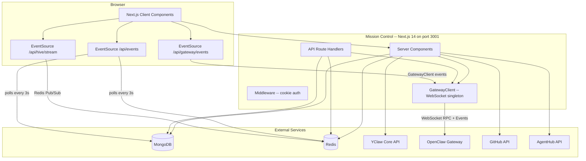
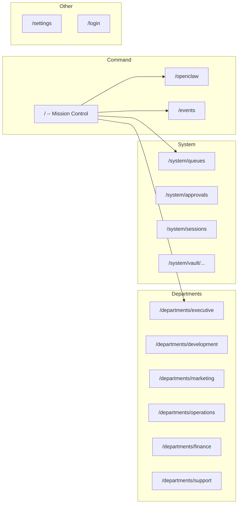
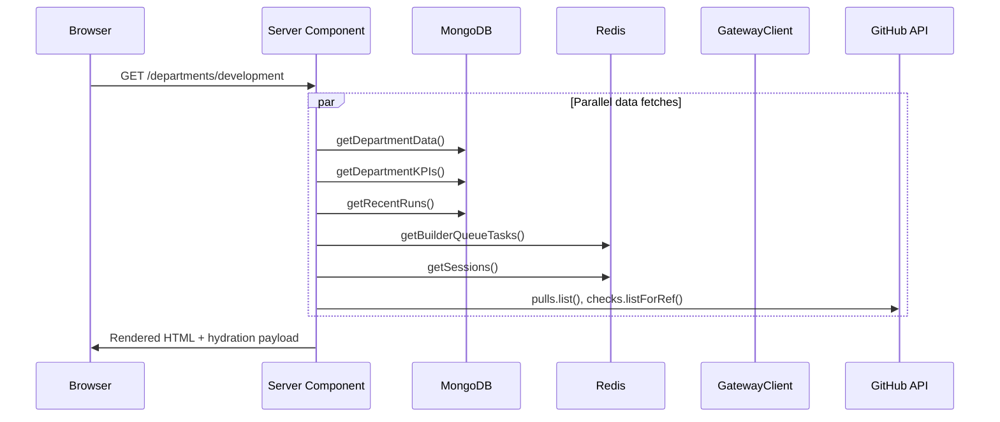
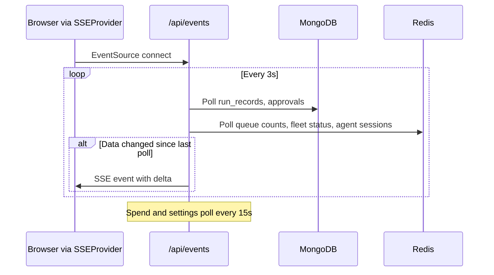
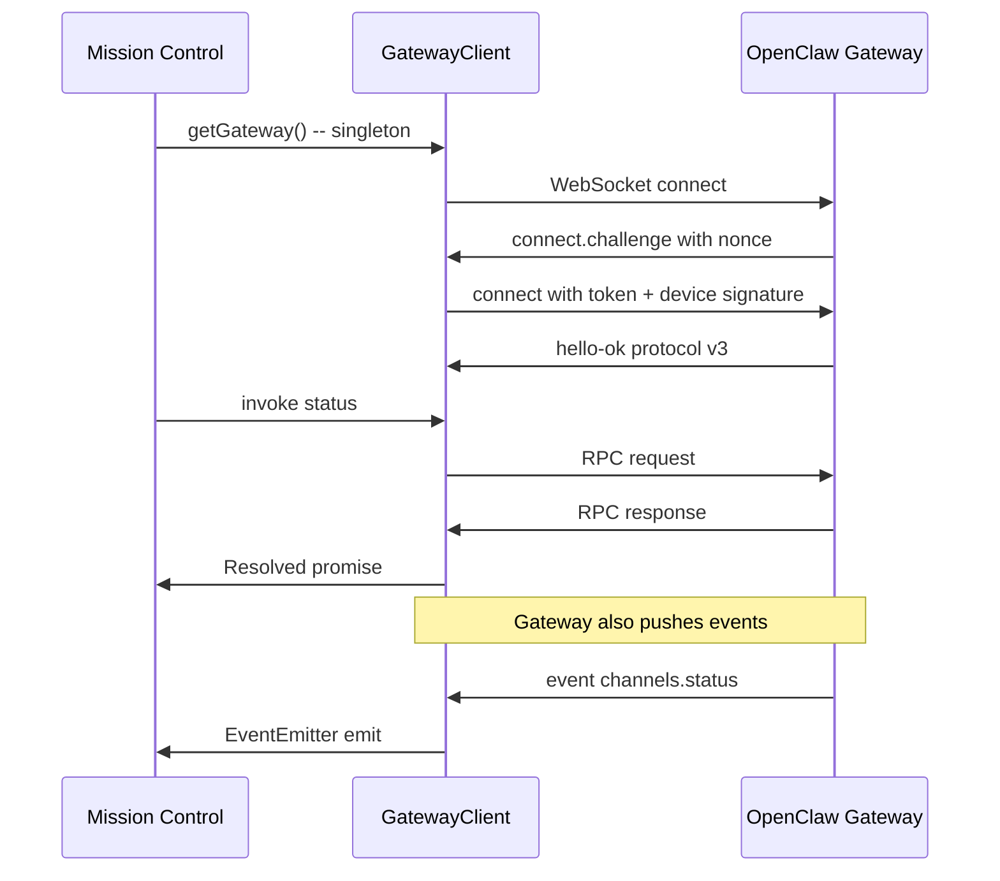

# Mission Control

Department-centric command center for the YClaw Agent System. A Next.js 14 dashboard that provides real-time visibility into 13 AI agents organized across 6 departments, with live force-graph visualization, budget management, and OpenClaw gateway integration.

Runs on port **3001**. Deployed as a standalone Docker image to ECS Fargate (separate ECR repo from the core runtime).

## Table of Contents

- [Architecture Overview](#architecture-overview)
- [Setup](#setup)
- [Environment Variables](#environment-variables)
- [Routes and Pages](#routes-and-pages)
- [API Endpoints](#api-endpoints)
- [Data Flow](#data-flow)
- [Real-Time Systems](#real-time-systems)
- [State Management](#state-management)
- [Design System](#design-system)
- [Project Structure](#project-structure)
- [Deployment](#deployment)

## Architecture Overview

Mission Control is a server-rendered Next.js 14 application using the App Router. Server Components fetch data from MongoDB, Redis, the YClaw API, and the OpenClaw gateway at request time. Client Components subscribe to SSE streams for real-time updates. The application degrades gracefully when any backing service is unavailable -- loaders return empty arrays, default objects, or `null` instead of failing the page.



### Authentication

All routes except `/login`, `/api/health`, and `/api/debug/*` require authentication. The middleware (`middleware.ts`) checks for an `mc_api_key` cookie that matches the `MC_API_KEY` environment variable. The login page sets a 7-day HTTP-only cookie via a Server Action. If `MC_API_KEY` is unset, the middleware still redirects because it treats the missing key as unauthenticated configuration.

## Setup

### Prerequisites

- Node.js 20 LTS
- npm (monorepo workspace)
- Access to MongoDB and Redis (optional but recommended for full functionality)

### Install and Run

```bash
# From the repository root
npm install

# Build workspace dependencies first
npm run build --workspace=packages/memory
npm run build --workspace=packages/core

# Start the dev server
npm run dev --workspace=packages/mission-control
```

The app starts at `http://localhost:3001`.

### Available Scripts

| Script | Command | Description |
|--------|---------|-------------|
| `dev` | `next dev -p 3001` | Start development server with hot reload |
| `build` | `next build` | Create production build (standalone output) |
| `start` | `next start -p 3001` | Run production server |
| `lint` | `next lint` | Run ESLint |

## Environment Variables

### Core

| Variable | Required | Description |
|----------|----------|-------------|
| `MC_API_KEY` | Yes | API key for dashboard authentication |
| `MONGODB_URI` | No | MongoDB connection string. Dashboard degrades gracefully without it |
| `REDIS_URL` | No | Redis connection string. Real-time features and queue views require it |
| `GITHUB_TOKEN` | No | GitHub PAT for PR data and org file editing |
| `VAULT_PATH` | No | Filesystem path to the Claudeception vault (defaults to `../../vault`) |

### OpenClaw Gateway

| Variable | Required | Description |
|----------|----------|-------------|
| `OPENCLAW_URL` | No | OpenClaw HTTP base URL (defaults to Tailscale address) |
| `OPENCLAW_GATEWAY_TOKEN` | No | Bearer token for OpenClaw API and WebSocket auth |
| `GATEWAY_WS_URL` | No | OpenClaw WebSocket URL (defaults to wss Tailscale address) |
| `GATEWAY_DEVICE_PUBLIC_KEY` | No | Ed25519 public key PEM for device auth |
| `GATEWAY_DEVICE_PRIVATE_KEY` | No | Ed25519 private key PEM for device auth |
| `GATEWAY_DEVICE_FINGERPRINT` | No | Device fingerprint for gateway handshake |
| `GATEWAY_SKIP_DEVICE_AUTH` | No | Set truthy to skip Ed25519 device auth |

### Integrations

| Variable | Required | Description |
|----------|----------|-------------|
| `YCLAW_API_URL` | No | YClaw core runtime URL (defaults to `https://agents.yclaw.ai`) |
| `YCLAW_API_KEY` | No | API key for the YClaw core runtime |
| `AGENTHUB_INTERNAL_URL` | No | AgentHub internal ALB URL |
| `AGENTHUB_MC_API_KEY` | No | AgentHub API key (read-only) |

## Routes and Pages

### Page Hierarchy



### Command Pages

| Route | Description |
|-------|-------------|
| `/` | Main dashboard. Displays The Hive (live 2D/3D force-graph visualization of all agents), KPI stats (active agents, sessions, queue depth, alerts), activity feed, top active agents, and quick links. |
| `/openclaw` | OpenClaw orchestrator dashboard. Shows gateway health, model pipeline, sessions and load, channel connectivity, alerts, and cron automation status. Includes a settings drawer for runtime configuration. |
| `/events` | Live event stream. Displays recent agent run records from MongoDB with a live SSE overlay for real-time updates. |

### Department Pages

Each department page follows a consistent pattern: a server component fetches data in parallel (department data, KPIs, recent runs, agent spend, budgets), then passes it to a client component with tabbed sub-views.

| Route | Agents | Key Data |
|-------|--------|----------|
| `/departments/executive` | Strategist, Reviewer | Standup synthesis, objectives, approvals, budget overview, AgentHub commits |
| `/departments/development` | Architect, Designer | GitHub PRs, builder queue depths (P0-P3), dispatcher status, AgentHub DAG |
| `/departments/marketing` | Ember, Forge, Scout | Published content, generated assets, scout reports, experiment posts, cross-learning, schedules |
| `/departments/operations` | Sentinel | ECS fleet status, audit log, sentinel audits, health checks, cache stats, memory status |
| `/departments/finance` | Treasurer | Treasury data, wallet balances, attention items |
| `/departments/support` | Keeper, Guide | Community temperature (derived from Keeper 24h activity), moderation runs |

### System Pages

| Route | Description |
|-------|-------------|
| `/system/queues` | Builder priority queue viewer. Displays tasks across P0 (safety), P1 (reviews), P2 (issues), P3 (background) queues from Redis. |
| `/system/approvals` | Pending deploy approvals from MongoDB and vault proposals from the filesystem inbox. Includes approve/reject actions. |
| `/system/sessions` | Session table showing all active and recent sessions from Redis. Displays session ID, owner agent, task, thread key, state, turn count, and duration. |
| `/system/vault/[[...path]]` | Claudeception vault browser. Renders Markdown files from the vault filesystem with a sidebar tree navigator. Supports directory listing, file download via `/system/vault/raw/...`. Path traversal is prevented. |

### Redirect Aliases

| From | To |
|------|-----|
| `/agents` | `/` |
| `/agents/[name]` | `/departments/{dept}?agent={name}` |
| `/treasury` | `/departments/finance` |
| `/elon` | `/openclaw` |

## API Endpoints

### Health and Debug

| Method | Endpoint | Auth | Description |
|--------|----------|------|-------------|
| `GET` | `/api/health` | No | Returns `{ status: "ok" }`. Use for ALB health checks. |
| `GET` | `/api/debug/openclaw` | No | Connectivity diagnostics for OpenClaw gateway. Tests health, tools/invoke, and chat completions endpoints with latency measurements. |

### Real-Time Streams (SSE)

| Method | Endpoint | Transport | Events Emitted |
|--------|----------|-----------|---------------|
| `GET` | `/api/events` | MongoDB + Redis polling (3s) | `system:health`, `fleet:status`, `agent:status`, `activity:update`, `approvals:count`, `queue:update`, `spend:updated`, `settings:updated` |
| `GET` | `/api/hive/stream` | Redis Pub/Sub (`hive:events`, `hive:agent-status`) | `hive:event`, `agent:status` |
| `GET` | `/api/hive/status` | Redis snapshot | (JSON response, not SSE) Agent real-time statuses |
| `GET` | `/api/audit/stream` | Redis Pub/Sub (`audit:events`) | `audit:event` |
| `GET` | `/api/gateway/events` | WebSocket forwarding | `channels.status`, `sessions.updated`, `status`, `reconnected` |

All SSE streams include 15-second keepalive pings and clean up on client disconnect.

### Data APIs

| Method | Endpoint | Description |
|--------|----------|-------------|
| `GET` | `/api/audit` | Query audit events from MongoDB. Filters: `timeRange` (24h/7d/30d), `types`, `agents`, `severities`, `search`, `limit` (max 1000). |
| `GET` | `/api/gateway/health` | Returns `{ connected, epoch }` for the WebSocket gateway client. |
| `POST` | `/api/gateway/rpc` | Proxy for OpenClaw RPC calls. Body: `{ method, params }`. Returns `{ ok, result }` or `{ ok: false, error }`. |
| `POST` | `/api/chat` | Send chat message to OpenClaw. Body: `{ message, images?, stream? }`. Supports up to 4 image data URLs (max 5MB each). Set `stream: true` for SSE response. |

### Organization and Fleet

| Method | Endpoint | Description |
|--------|----------|-------------|
| `GET` | `/api/org/fleet` | Fleet config from Redis: mode, default/fallback models, deploy mode, feature flags. |
| `PUT` | `/api/org/fleet` | Update fleet config. Publishes to Redis Pub/Sub, logs to MongoDB audit. |
| `GET` | `/api/org/settings` | Organization settings from MongoDB with defaults fallback. |
| `PATCH` | `/api/org/settings` | Update org settings. Validates against allowlist (`defaultModel`, `fallbackModel`, `deployMode`, `fleetMode`). Syncs fleet mode to Redis. |
| `GET` | `/api/org/settings/audit` | Paginated settings audit trail. Params: `page`, `limit`. |
| `GET` | `/api/org/spend` | Monthly spend data aggregated by department and agent. Returns burn rate, EOM projection, budget utilization. Param: `month` (YYYY-MM). |
| `GET` | `/api/org/files/[filename]` | Read org prompt file from GitHub (`prompts/*.md`). Returns content, SHA, and agent-protected flag. |
| `PUT` | `/api/org/files/[filename]` | Update org prompt file via GitHub API. Body: `{ content, sha, message? }`. |

### Budget

| Method | Endpoint | Description |
|--------|----------|-------------|
| `GET` | `/api/budget/config` | Budget config: mode, daily/monthly limits (USD), alert threshold, action. |
| `PATCH` | `/api/budget/config` | Update budget config. Validates numeric ranges and action values (`alert`, `pause`, `hard_stop`). |

### Department

| Method | Endpoint | Description |
|--------|----------|-------------|
| `GET` | `/api/departments/executive` | Executive department live data + pending approval count. |
| `GET` | `/api/departments/development` | Development department live data. |
| `GET` | `/api/departments/marketing` | Marketing department live data. |
| `GET` | `/api/departments/operations` | Operations department live data. |
| `GET` | `/api/departments/support` | Support department live data. |
| `GET` | `/api/departments/settings` | Department-specific settings. |

## Data Flow

### Server-Side Rendering

Each page server component fetches all required data in parallel using `Promise.all`, then passes it to the client component for interactive rendering:



### Real-Time Update Flow

The primary SSE endpoint (`/api/events`) polls data sources every 3 seconds and emits only deltas (changed data):



### OpenClaw Integration

The OpenClaw gateway connection uses two communication channels:

1. **WebSocket RPC** (`GatewayClient` singleton in `src/lib/gateway-ws.ts`): Persistent connection with challenge-response handshake (Ed25519 device auth), auto-reconnect with exponential backoff (max 30s), and request queuing for calls made before connection is established. Used for all RPC calls (status, sessions, cron, skills, config). Idempotency keys are auto-injected for write methods.

2. **HTTP** (`src/lib/openclaw.ts`): Used for chat completions (`/v1/chat/completions`), which supports streaming SSE responses. Multimodal -- images are sent as data URL content blocks.



## Real-Time Systems

Mission Control uses three SSE channels, each optimized for different update frequencies:

| Channel | Endpoint | Transport | Update Frequency | Purpose |
|---------|----------|-----------|-----------------|---------|
| Primary | `/api/events` | MongoDB + Redis polling | 3s (15s for spend) | System health, agent status, queue counts, activity feed, approvals |
| Hive | `/api/hive/stream` | Redis Pub/Sub | Event-driven | Force graph particles and agent state changes |
| Gateway | `/api/gateway/events` | WebSocket forwarding | Event-driven | OpenClaw channel status, session updates |
| Audit | `/api/audit/stream` | Redis Pub/Sub | Event-driven | Governance and settings change events |

### SSE Provider

The `SSEProvider` component (wraps the entire app via `Providers`) maintains a single `EventSource` connection to `/api/events`. Child components subscribe to specific event types via `useEventStream`. The provider:

- Shares one connection across all subscribers (no duplicate connections)
- Lazily registers SSE event listeners per event type
- Handles reconnection automatically (EventSource built-in)

## State Management

| Store | Library | Scope | Persistence |
|-------|---------|-------|-------------|
| Server data cache | `@tanstack/react-query` | All client components | Memory (10s stale time, no refetch on focus) |
| Real-time events | `SSEProvider` (React Context) | All client components | None (event-driven) |
| Sidebar state | Zustand | Navigation UI | `localStorage` (collapsed state + expanded departments) |
| Chat state | Zustand | OpenClaw chat drawer | Memory (messages and open/closed state) |

### Key Data Libraries (`src/lib/`)

| Module | Data Source | Purpose |
|--------|-----------|---------|
| `mongodb.ts` | MongoDB | Singleton client with 3s connection timeout |
| `redis.ts` | Redis | Singleton client with lazy connect. Graceful null returns on failure. Provides: `get`, `set`, `scan`, `hgetall`, `zrange`, `zcard`, `publish`, `ping`. |
| `gateway-ws.ts` | OpenClaw | WebSocket RPC client: challenge-response auth, reconnect with backoff, request queue, state cache |
| `openclaw.ts` | OpenClaw | HTTP chat completions (streaming and non-streaming) plus RPC convenience wrappers |
| `yclaw-api.ts` | YClaw Core | Agent schedules, cache stats, memory status |
| `github.ts` | GitHub | Octokit client for PR and check data |
| `agenthub-api.ts` | AgentHub | Read-only: git commits, DAG leaves, diffs, channels, posts |
| `agents.ts` | Static | Agent and department registry. 11 agents across 6 departments with metadata (emoji, role, system affiliation). |
| `department-data.ts` | MongoDB + Redis | Aggregated department live data |
| `department-kpis.ts` | MongoDB | Department KPI calculations |
| `treasury-data.ts` | MongoDB | Wallet balances, DeFi positions |
| `cost-queries.ts` | MongoDB | Per-agent spend data |
| `builder-queue.ts` | Redis | Builder task queue state and dispatcher status |
| `approvals-queries.ts` | MongoDB | Deploy approval records |
| `auth.ts` | Cookies | Server-side cookie verification (`mc_api_key`) |

## Design System

Terminal-inspired dark theme using Tailwind CSS with a custom color palette (Catppuccin-influenced).

### Color Tokens

| Token | Hex | Usage |
|-------|-----|-------|
| `terminal-bg` | `#0a0a0f` | Page background |
| `terminal-surface` | `#111118` | Card and panel backgrounds |
| `terminal-border` | `#1e1e2e` | Borders |
| `terminal-muted` | `#2a2a3a` | Muted backgrounds, hover states |
| `terminal-text` | `#cdd6f4` | Primary text |
| `terminal-dim` | `#6c7086` | Secondary/muted text |
| `terminal-green` | `#a6e3a1` | Success, active states |
| `terminal-red` | `#f38ba8` | Errors, alerts |
| `terminal-yellow` | `#f9e2af` | Warnings |
| `terminal-blue` | `#89b4fa` | Links, Development department |
| `terminal-purple` | `#cba6f7` | Branding accent, Finance department |
| `terminal-cyan` | `#89dceb` | Agent names, Executive department |
| `terminal-orange` | `#fab387` | Marketing department |

**Typography:** JetBrains Mono monospace stack (`JetBrains Mono, Fira Code, Consolas, monospace`).

**Mode:** Dark mode enforced via `class="dark"` on `<html>`.

### Department Color Mapping

Each department has a consistent color across the sidebar, Hive graph, and department pages:

| Department | Token | Hex |
|-----------|-------|-----|
| Executive | `terminal-cyan` | `#89dceb` |
| Development | `terminal-blue` | `#89b4fa` |
| Marketing | `terminal-orange` | `#fab387` |
| Operations | `terminal-green` | `#a6e3a1` |
| Finance | `terminal-purple` | `#cba6f7` |
| Support | `terminal-yellow` | `#f9e2af` |

### Hive Visualization

The Hive is a live force-directed graph on the home page that visualizes all 11 agents plus external service nodes:

- **2D mode:** `react-force-graph-2d` with custom canvas painting (`paint-external.ts`)
- **3D mode:** `react-force-graph-3d` with Three.js mesh generation (`three-node-factory.ts`) and ambient particle effects (`three-ambient-motes.ts`)
- **Particle system:** Animated particles travel along bezier curves between nodes to represent events (PRs, tasks, alerts, LLM calls, external service interactions)
- **Big moments:** Overlay effects (starburst, ripple, gold pulse, error flash) triggered by significant events
- **Data:** Agent nodes grouped by department anchors in hexagonal layout. External nodes (GitHub, Twitter, Slack, etc.) orbit the periphery.
- **Mobile:** Falls back to a list view (`mobile-agent-list.tsx`, `mobile-hive-summary.tsx`)

## Project Structure

```
src/
├── app/                          # Next.js App Router
│   ├── layout.tsx                # Root layout: nav, sidebar, status header, chat drawer
│   ├── page.tsx                  # Home: Hive visualization + KPI dashboard
│   ├── login/page.tsx            # Authentication
│   ├── openclaw/page.tsx         # OpenClaw gateway dashboard
│   ├── events/                   # Event stream page + live overlay
│   ├── departments/
│   │   ├── layout.tsx            # Passthrough layout
│   │   ├── executive/            # page.tsx (server) + client.tsx
│   │   ├── development/          # page.tsx (server) + client.tsx
│   │   ├── marketing/            # page.tsx (server) + client.tsx
│   │   ├── operations/           # page.tsx (server) + client.tsx
│   │   ├── finance/              # page.tsx (server, uses TreasuryClient)
│   │   └── support/              # page.tsx (server) + client.tsx
│   ├── system/
│   │   ├── queues/page.tsx       # Builder priority queue
│   │   ├── approvals/page.tsx    # Deploy approvals + vault proposals
│   │   ├── sessions/page.tsx     # Session table
│   │   └── vault/                # Claudeception vault browser + raw download route
│   ├── settings/page.tsx         # Fleet config and connections
│   ├── api/                      # Route handlers (see API Endpoints)
│   └── globals.css               # Global styles and Tailwind imports
├── components/
│   ├── nav.tsx                   # Sidebar navigation with department agent trees
│   ├── providers.tsx             # QueryClient + SSEProvider wrapper
│   ├── sidebar-wrapper.tsx       # Collapsible sidebar container
│   ├── status-header.tsx         # Top bar: health dots + fleet status
│   ├── chat-drawer.tsx           # OpenClaw chat panel (streaming, image upload)
│   ├── fleet-banner.tsx          # ECS fleet status banner
│   ├── hive/                     # Force graph visualization system
│   │   ├── hive-container.tsx    # Mount point (2D/3D switch)
│   │   ├── hive-graph.tsx        # 2D graph (react-force-graph-2d)
│   │   ├── graph-renderer-3d.tsx # 3D graph (three.js)
│   │   ├── hive-types.ts         # Node, link, particle, event type definitions
│   │   ├── hive-overlay.tsx      # Canvas overlay for particles and effects
│   │   ├── paint-external.ts     # Canvas node painting functions
│   │   ├── three-node-factory.ts # Three.js mesh generation
│   │   ├── three-ambient-motes.ts# Ambient mote particle effects
│   │   ├── use-hive-graph-data.ts# Graph data transformation hook
│   │   ├── external-nodes.ts     # External service node definitions
│   │   ├── view-mode-toggle.tsx  # 2D/3D toggle
│   │   └── mobile-*.tsx          # Mobile-responsive fallbacks
│   ├── agenthub/                 # AgentHub integration widgets
│   │   ├── ExplorationDAG.tsx    # Git commit DAG (react-flow)
│   │   ├── DiffViewer.tsx        # Commit diff viewer
│   │   ├── CrossLearnPanel.tsx   # Cross-learning post feed
│   │   └── ExperimentDashboard.tsx
│   ├── audit/                    # Audit timeline with filters and types
│   └── ...                       # 80+ feature components: agent cards, budget editors,
│                                 # KPI cards, settings drawers, event feeds, etc.
├── hooks/
│   ├── use-hive-sse.ts           # Hive SSE subscription hook
│   ├── use-audit-events.ts       # Audit stream subscription hook
│   ├── use-department-settings.ts# Department settings fetcher
│   ├── use-media-query.ts        # Responsive breakpoint detection
│   ├── use-sound-engine.ts       # Audio feedback (howler.js)
│   └── useGatewayEvents.ts       # Gateway SSE subscription hook
├── lib/
│   ├── actions/                  # Server actions (fleet, budget, approvals, triggers, ECS)
│   ├── hooks/                    # SSE provider + event stream context hooks
│   ├── hive/                     # Hive data: particles, big moments, external nodes
│   ├── audio/                    # Sound engine (howler.js wrapper)
│   ├── mongodb.ts                # MongoDB singleton
│   ├── redis.ts                  # Redis singleton + utility functions
│   ├── gateway-ws.ts             # OpenClaw WebSocket RPC client
│   ├── openclaw.ts               # OpenClaw HTTP + RPC wrappers
│   ├── agents.ts                 # Static agent/department registry
│   ├── auth.ts                   # Cookie-based auth verification
│   ├── agenthub-api.ts           # AgentHub read-only API client
│   ├── yclaw-api.ts               # YClaw core runtime API client
│   ├── github.ts                 # Octokit GitHub client
│   └── ...                       # Domain query modules (treasury, cost, operations, etc.)
├── stores/
│   ├── chat-store.ts             # Zustand: chat drawer messages and visibility
│   └── sidebar-store.ts          # Zustand: sidebar collapse + department expand state
└── types/
    └── gateway.ts                # OpenClaw gateway type definitions
```

## Deployment

### Docker Build

The Dockerfile (`packages/mission-control/Dockerfile`) uses a multi-stage build optimized for standalone output:

```bash
# Build from the repository root
docker build -f packages/mission-control/Dockerfile -t mission-control .

# Run
docker run -p 3001:3001 \
  -e MC_API_KEY=your-key \
  -e MONGODB_URI=mongodb://... \
  -e REDIS_URL=redis://... \
  mission-control
```

**Build stages:**

1. **deps** -- Installs npm dependencies (workspace-aware `npm ci`)
2. **builder** -- Builds `@yclaw/memory`, `@yclaw/core`, then `mission-control` with `NEXT_TELEMETRY_DISABLED=1`
3. **runner** -- Alpine runtime with only the standalone server bundle. Runs as `nextjs` user (UID 1001) on port 3001.

The `ws` module is webpack-externalized and copied separately into the runtime image because the standalone build cannot resolve monorepo workspace dependencies (`@yclaw/core`) at runtime.

### Health Check

`GET /api/health` returns `{ "status": "ok" }` and requires no authentication. Use this for ALB target group health checks.

### Key Dependencies

| Package | Purpose |
|---------|---------|
| `next` (14.x) | App Router framework |
| `react` / `react-dom` (18.x) | UI rendering |
| `@tanstack/react-query` | Server state cache |
| `zustand` | Client state management |
| `@xyflow/react` | Flow diagrams (AgentHub DAG) |
| `react-force-graph-2d/3d` | Hive visualization |
| `three` | 3D rendering for Hive |
| `recharts` | Chart components |
| `mongodb` | Database driver |
| `ioredis` | Redis driver |
| `ws` | WebSocket client (OpenClaw gateway) |
| `@aws-sdk/client-ecs` | ECS fleet status |
| `@octokit/rest` | GitHub API |
| `howler` | Audio feedback |
| `marked` | Markdown rendering (vault) |
| `tailwindcss` | Utility-first CSS |
