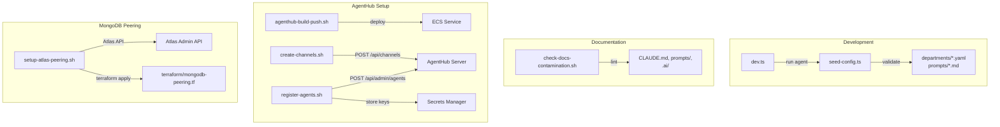

# scripts/ -- Operational Scripts

Utility scripts for local development, configuration validation, infrastructure setup, and AgentHub management.

## Scripts

| Script | Language | Purpose |
|--------|----------|---------|
| [`dev.ts`](#devts) | TypeScript | Local development runner for the agent system |
| [`seed-config.ts`](#seed-configts) | TypeScript | Validate all agent configs and prompts |
| [`check-docs-contamination.sh`](#check-docs-contaminationsh) | Bash | Lint docs for stale/incorrect terminology |
| [`setup-atlas-peering.sh`](#setup-atlas-peeringsh) | Bash | Automate MongoDB Atlas VPC peering setup |
| [`agenthub-build-push.sh`](#agenthub-build-pushsh) | Bash | Build, push, and deploy AgentHub to ECS |
| [`create-channels.sh`](#create-channelssh) | Bash | Create default AgentHub channels |
| [`register-agents.sh`](#register-agentssh) | Bash | Register agents with AgentHub and store keys |

## Script Details

### dev.ts

Local development runner for the yclaw system. Starts minimal infrastructure (MongoDB, Redis, EventBus) and executes agent tasks.

```bash
# List all agents and their triggers
npx tsx scripts/dev.ts

# Run all cron tasks for a specific agent
npx tsx scripts/dev.ts ember

# Run a single agent task
npx tsx scripts/dev.ts ember daily_content_batch

# Dry-run mode (logs actions without executing)
DRY_RUN=true npx tsx scripts/dev.ts ember daily_content_batch
```

Requires: `.env` file with `MONGODB_URI`, `REDIS_URL`, and provider API keys.

### seed-config.ts

Validates all agent YAML configs, system prompts, org chart, and event catalog. Exits non-zero on validation failure.

```bash
npx tsx scripts/seed-config.ts
```

Output includes: agent count, department assignments, model assignments, prompt counts, action counts, trigger counts, org chart, and event catalog.

### check-docs-contamination.sh

Lints documentation files for stale terminology that contradicts current protocol decisions. Checks for:

| Pattern | Why It Fails |
|---------|--------------|
| Crediez / GZC references | Removed -- USDC is the direct currency |
| Hardcoded 10% accrual rate | Rate is DAO-controlled, not fixed |
| "distributed to wallet" | Options are held by market PDA; users must claim |
| SOL as buy/sell currency | USDC is the currency; SOL is gas only |
| "YClaw platform" | YClaw is a protocol, not a platform |
| Banned hype terms | Brand voice prohibits "revolutionary", "WAGMI", "degen", etc. |

```bash
# Check repo root (default)
./scripts/check-docs-contamination.sh

# Check a specific directory
./scripts/check-docs-contamination.sh /path/to/docs
```

Exits 0 if clean, 1 if contamination found. Suitable as a CI step.

### setup-atlas-peering.sh

Automates VPC peering between MongoDB Atlas and the yclaw VPC. Requires Atlas cluster on M10+ dedicated tier.

```bash
export ATLAS_PUBLIC_KEY="<your-atlas-public-key>"
export ATLAS_PRIVATE_KEY="<your-atlas-private-key>"
export ATLAS_PROJECT_ID="<your-atlas-project-id>"
./scripts/setup-atlas-peering.sh
```

Steps performed:
1. Check for existing peering connections
2. Find Atlas network container for `us-east-1`
3. Create peering connection via Atlas Admin API
4. Wait for AWS peering connection to appear (polls up to ~3 minutes)
5. Run targeted `terraform apply` to accept peering and add routes
6. Add VPC CIDR to Atlas IP Access List

Manual follow-up: Remove the "Allow Access from Anywhere" entry in Atlas IP Access List.

### agenthub-build-push.sh

Builds the AgentHub Docker image from `infra/agenthub/`, pushes to ECR, and triggers an ECS redeployment.

```bash
./scripts/agenthub-build-push.sh
```

Requires: AWS CLI configured with appropriate permissions, Docker running.

Target: ECR `yclaw-agenthub`, ECS cluster `yclaw-cluster-production`, service `yclaw-agenthub`.

### create-channels.sh

Creates the default set of AgentHub channels. Idempotent -- re-running skips existing channels.

```bash
./scripts/create-channels.sh <agenthub-url> <any-agent-api-key>
```

Creates 10 channels: `dev`, `marketing`, `ops`, `executive`, `finance`, `support`, `cross-learn`, `build-decisions`, `experiment-results`, `alerts`.

### register-agents.sh

Registers agents with AgentHub and stores their API keys in AWS Secrets Manager. Idempotent -- skips agents that already have keys.

```bash
export AGENTHUB_ADMIN_KEY="your-admin-key"

# Dry run (prints keys but does not store in Secrets Manager)
./scripts/register-agents.sh <agenthub-url>

# Store keys in Secrets Manager
STORE_KEYS=true ./scripts/register-agents.sh <agenthub-url>
```

Registers 16 agents: `strategist`, `builder`, `worker-1`, `worker-2`, `worker-3`, `reviewer`, `deployer`, `architect`, `designer`, `ember`, `scout`, `sentinel`, `forge`, `guide`, `keeper`, `treasurer`.

Keys are stored in Secrets Manager at `yclaw/agenthub-agent-keys` as a JSON object mapping agent ID to API key. Existing keys are preserved (merge, not overwrite).

## Execution Flow


