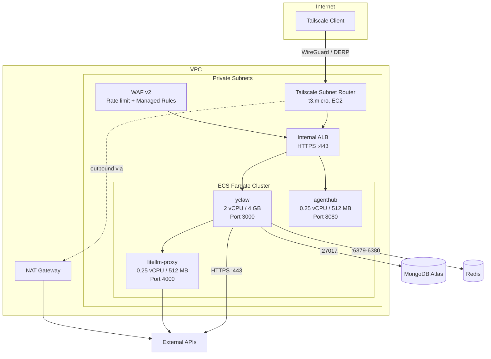

# terraform/ -- AWS Infrastructure as Code

Terraform configuration for the yclaw production environment on AWS. Manages the ECS cluster, networking, security, and supporting services.

## Quick Reference

| Resource | Value |
|----------|-------|
| AWS Region | `us-east-1` |
| AWS Account | `<AWS_ACCOUNT_ID>` |
| VPC | `<VPC_ID>` (`<VPC_CIDR>`) |
| ECS Cluster | `yclaw-cluster-production` |
| Terraform State | S3 `yclaw-terraform-state` / `agents/terraform.tfstate` |
| Provider | `hashicorp/aws ~> 5.30.0` |

## Architecture



## Terraform Files

| File | Resources | Purpose |
|------|-----------|---------|
| `main.tf` | ECS cluster, ECR, IAM, ALB, WAF, Security Groups, ECS service/task | Core infrastructure for yclaw |
| `agenthub.tf` | ECR, EFS, IAM, Security Groups, ALB target group, ECS service/task | AgentHub collaboration service |
| `github-oidc.tf` | OIDC provider, IAM role + policies | Keyless CI/CD from GitHub Actions |
| `tailscale.tf` | EC2 instance, Security Group, IAM | VPN subnet router for private ALB access |
| `mongodb-peering.tf` | VPC peering accepter, routes, SG rules | MongoDB Atlas VPC peering (conditional) |
| `production.tfvars` | Variable values | Production environment configuration |
| `terraform.tfvars` | Variable values | Base variable overrides |

## Resource Inventory

### ECS Services

| Service | Task Family | CPU / Memory | Image |
|---------|-------------|--------------|-------|
| `yclaw-production` | `yclaw-production` | 2048 / 4096 | `yclaw:latest` |
| `litellm-proxy` | `litellm-proxy` | 256 / 512 | `litellm-proxy:latest` |
| `yclaw-agenthub` | `yclaw-agenthub` | 256 / 512 | `yclaw-agenthub:latest` |

### Security

| Layer | Implementation |
|-------|---------------|
| **Network** | Internal ALB (no public IP), VPC-only CIDR (`<VPC_CIDR>`), egress restricted to specific ports (443, 27017, 6379-6380, 53) |
| **WAF** | Rate limiting (1000 req/5min per IP), AWS Managed Rules (Common, Bad Inputs), Bot Control (count-only) |
| **TLS** | ALB HTTPS with TLS 1.3 policy (`ELBSecurityPolicy-TLS13-1-2-2021-06`), HTTP-to-HTTPS redirect |
| **Secrets** | AWS Secrets Manager (single JSON blob per environment), individual keys injected as ECS container env vars |
| **Container** | Read-only root filesystem, ephemeral volumes for writable paths only |
| **VPN** | Tailscale subnet router in private subnet (DERP relay, no public IP) |
| **CI/CD** | GitHub Actions OIDC federation (no static AWS credentials) |
| **Deployment** | Circuit breaker with automatic rollback enabled |

### IAM Roles

| Role | Used By | Permissions |
|------|---------|-------------|
| `yclaw-task-execution-production` | ECS task execution | ECR pull, Secrets Manager read, CloudWatch Logs |
| `yclaw-task-production` | ECS task (runtime) | SES send, ECS read/update own service, CloudWatch Logs |
| `yclaw-agenthub-task-execution` | AgentHub task execution | ECR pull, Secrets Manager read |
| `yclaw-agenthub-task` | AgentHub task (runtime) | EFS mount/write |
| `yclaw-github-deploy-production` | GitHub Actions CI/CD | ECR push, ECS deploy, PassRole |
| `yclaw-tailscale-router-production` | Tailscale EC2 instance | SSM managed instance, Secrets Manager read |

### Networking

| Component | Details |
|-----------|---------|
| VPC | `<VPC_ID>` / `<VPC_CIDR>` |
| Public subnets | 3 (used by NAT Gateway) |
| Private subnets | 3 (ECS tasks, ALB, Tailscale router) |
| ALB | Internal, private subnets, deletion protection enabled |
| Tailscale | `t3.micro` in private subnet, advertises `<VPC_CIDR>`, DERP relay via NAT |

## Variables

| Variable | Type | Default | Description |
|----------|------|---------|-------------|
| `aws_region` | string | `us-east-1` | AWS region |
| `environment` | string | `production` | Environment name |
| `image_tag` | string | `latest` | Docker image tag |
| `vpc_id` | string | (required) | VPC ID |
| `public_subnet_ids` | list(string) | (required) | Public subnet IDs |
| `private_subnet_ids` | list(string) | (required) | Private subnet IDs |
| `certificate_arn` | string | (required) | ACM certificate ARN |
| `allowed_cidr_blocks` | list(string) | (required) | CIDR blocks for ALB access (never `0.0.0.0/0`) |
| `telegram_chat_id` | string | `""` | Telegram group chat ID |
| `waf_rate_limit` | number | `1000` | WAF rate limit per 5-min window per IP |
| `enable_tailscale_router` | bool | `true` | Create Tailscale subnet router |
| `tailscale_auth_key` | string | `""` | Tailscale auth key (first deploy only) |
| `atlas_vpc_cidr` | string | `""` | MongoDB Atlas VPC CIDR (for peering) |
| `atlas_peering_connection_id` | string | `""` | AWS peering connection ID (for Atlas) |

## Outputs

| Output | Description |
|--------|-------------|
| `ecr_repository_url` | ECR repository URL for yclaw |
| `ecs_cluster_name` | ECS cluster name |
| `ecs_service_name` | ECS service name |
| `log_group` | CloudWatch log group |
| `target_group_arn` | ALB target group ARN |
| `alb_dns_name` | ALB DNS name |
| `service_url` | Full HTTPS service URL |
| `github_actions_role_arn` | IAM role ARN for GitHub Actions (set as `AWS_ROLE_ARN` secret) |
| `tailscale_router_id` | Tailscale EC2 instance ID |
| `tailscale_router_private_ip` | Tailscale router private IP |
| `atlas_peering_status` | MongoDB Atlas VPC peering status |

## Usage

```bash
cd terraform

# Initialize (downloads provider, configures S3 backend)
terraform init

# Plan with production variables
terraform plan -var-file=production.tfvars

# Apply
terraform apply -var-file=production.tfvars

# Targeted apply (e.g., task definition only)
terraform apply -var-file=production.tfvars \
  -target=aws_ecs_task_definition.agents
```

## Conditional Resources

Some resources are conditionally created:

| Resource | Condition | Current State |
|----------|-----------|---------------|
| Tailscale subnet router | `var.enable_tailscale_router = true` | Deployed |
| MongoDB Atlas VPC peering | `var.atlas_peering_connection_id != ""` | Not active (using NAT IP whitelist) |
| Atlas egress SG rule | `var.atlas_vpc_cidr != ""` | Not active |

## GitHub Actions OIDC

CI/CD uses OIDC federation for keyless deploys. The trust policy restricts access to:
- Repository: `yclaw-ai/yclaw`
- Branch: `refs/heads/master`

The role ARN (`yclaw-github-deploy-production`) is stored as the `AWS_ROLE_ARN` GitHub secret.
